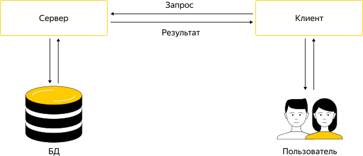

# Как работает API

## Web API {#web-api}

API веб-сервиса (Web API) — это набор готовых процедур, функций и структур, с помощью которых разработчики могут создавать свои программы, приложения, скрипты для работы с сервисом.



Яндекс&#160;Директ имеет свой API, которым могут пользоваться сторонние разработчики приложений. То, как они будут пользоваться им, зависит от:

- возможностей AP;
- сценариев работы, которые нужны разработчикам.

Как и веб-интерфейс, API Директа позволяет создавать рекламные материалы и управлять ими. Но с помощью API можно автоматизировать рутинные операции с большим объемом данных и настроить рекламу более точно.

Например, можно написать скрипт, который будет через API автоматически обновлять стоимость перехода по рекламному объявлению по вашему собственному алгоритму. Также можно интегрировать с Директом информационную систему компании — загрузить в Директ большое количество объявлений из базы данных, автоматически обновлять тексты объявлений при изменении цены товара, останавливать и возобновлять показы объявлений в зависимости от наличия товара на складе.



## Виды протоколов {#protocol}

### HTTP-протокол {#http}

Как правило, Web API использует протокол передачи данных HTTP (англ. _HyperText Transfer Protocol_). Этот протокол устанавливает правила обмена информацией и служит транспортом для передачи данных — с его помощью браузер загружает содержимое сайта на ваш компьютер или смартфон.

HTTP работает с сообщениями по технологии «клиент-сервер»:

- Клиент инициирует соединение и посылает HTTP-запрос.
- Сервер ожидает соединения для получения запроса, производит необходимые действия и возвращает обратно HTTP-ответ с результатом.

Основным объектом манипуляции в HTTP является ресурс, на который указывает  URI (англ. _Uniform Resource Identifier_) в запросе клиента. Обычно такими ресурсами являются хранящиеся на сервере файлы, но ими могут быть логические объекты или что-то абстрактное.

Способ передачи данных и набор доступных методов зависят от версии протокола. Большинство приложений для своей работы используют HTTP протокол версии 1.1.

Особенностью протокола HTTP является возможность указать в запросе и ответе способ представления одного и того же ресурса по различным параметрам: формату, кодировке, языку и т. д.

### HTTPS-протокол {#https}

У HTTP-протокола есть один недостаток: данные передаются в открытом виде и никак не защищены.

Для установки безопасного соединения используется протокол HTTPS (англ. _HyperText Transfer Protocol Secure_) — расширение протокола HTTP для поддержки шифрования. Подробнее в статье [Что такое протокол HTTPS](https://yandex.ru/blog/company/77455).

## REST API {#rest-api}

REST API — это веб-сервисы, которые позволяют отправлять запросы к ресурсам по URI. HTTP‑запросы и ответы передаются через интернет и не зависят от языка запроса. Ответы обычно возвращаются в формате JSON или XML.

REST API имеют много разных путей, или конечных точек, с различными параметрами, которые можно настраивать.

