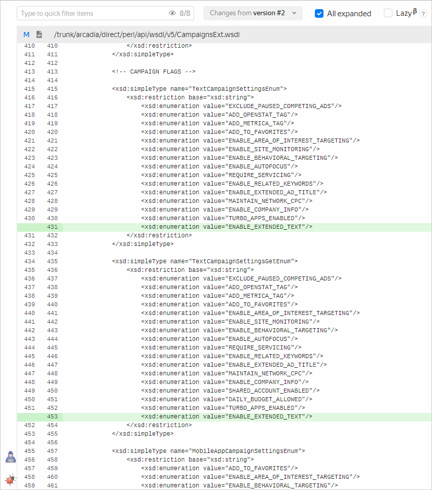
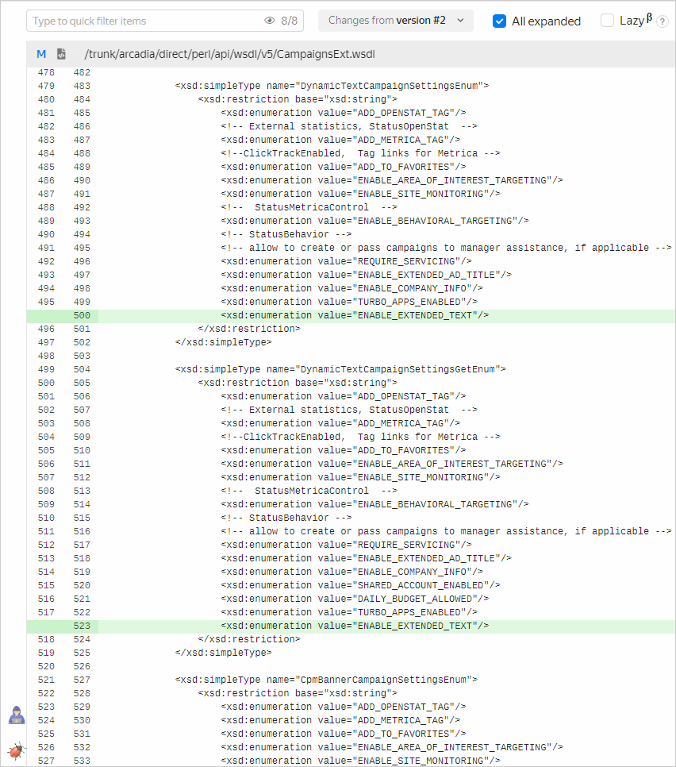

# Практическое задание по документированию API

Это практическое задание требует высокого уровня самостоятельности. Оно максимально приближено к боевому. Постарайтесь разобраться сами, а если не получится — задавайте вопросы.

## Суть задания

Вы получили задачу по документации API Директа. Нужно описать новую настройку рекламных кампаний.

**Текст задачи, который вы получили от заказчика:**

"В сервисе `Campaigns` для текстовых и динамических кампаний в параметры кампаний добавляется необязательная настройка `ENABLE_EXTENDED_TEXT`. Настройка включает подстановку описания товара с сайта рекламодателя в текст объявления. По умолчанию настройка отключена. Поддерживается добавление и обновление."





Дифф от заказчика представлен в формате WSDL. Подробнее об этом формате в разделе [WSDL](../api-theory/formats/wsdl-markup.md).

## Что нужно сделать

1. Подумайте, в какие разделы Справки API Директа нужно добавить эту информацию.
1. Добавьте упоминание настройки во все необходимые разделы.

На каждом этапе сопоставляйте полученное задание и код: иногда заказчики допускают ошибки, нужно замечать несоответствия и спрашивать, какой вариант верный.

## Вспомогательные вопросы

- Где найти документацию API Директа?
- В каких разделах документации упоминаются параметры и настройки кампаний? Как это проверить?
- В каком разделе описаны различные сервисы, в том числе `Campaigns`?
- Какие методы описаны для этого сервиса? Для каких **трех** методов поддерживается настройка `ENABLE_EXTENDED_TEXT`?
- Какие типы кампаний есть в сервисе `Campaigns`? В какие из них нужно добавить настройку?
- Где в коде перечислены другие настройки кампаний?
- Что требуется указать, чтобы описание настройки было исчерпывающим? Подсказка: дата релиза настройки — сегодняшняя.
    

## Ожидаемый результат в комментариях
Ссылка на PR и на хост.

У Справки API Директа есть особенность: иногда письма с результатом сборки не содержат ошибок, но внесенных изменений на хосте нет. В таком случае нужно смотреть лог сборки в Teamcity.

