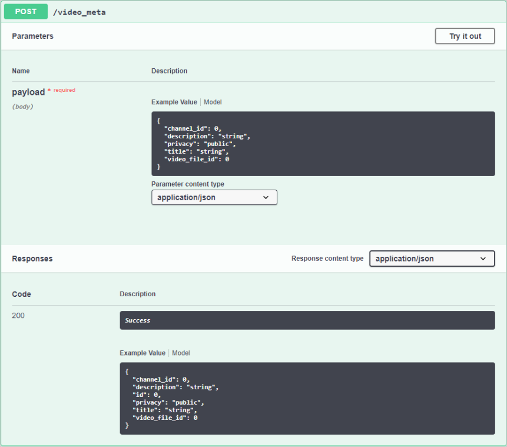
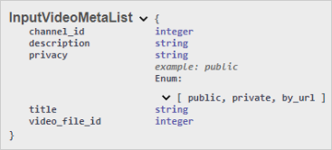

# Практическое задание со Swagger

## Что нужно сделать
Проанализируйте скриншоты из Swagger и ответьте на вопросы.

## Как это сделать

Ответьте на вопросы:

1. К какому ресурсу отправляется запрос?
2. Как метод взаимодействует с данными на сервере?
3. Где передаются параметры (см. типы)?
4. Какой тип принимает каждый из параметров в запросе?
5. Какой параметр есть только в ответе?

Если вы не понимаете, как ответить на вопросы, то вернитесь в раздел [Общие сведения](../api-theory/workflow.md).

## Ожидаемый результат в комментариях
Ответы на пять вопросов выше.

