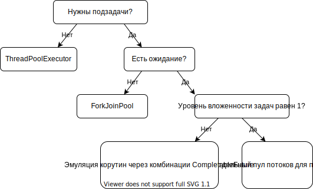

# ForkJoinPool
TL;DR:

Рекомендуется не создавать новых экземпляров ```ForkJoinPool```, а использовать дефолтный ```ForkJoinPool.commonPool()```.
Его можно использовать только для CPU-bound задач.
В потоках пула запрещено любое ожидание, в том числе сетевые вызовы и длинные блокировки.
По тем же причинам ожидание недопустимо в параллельных стримах.
Так же не стоит использовать его для задач, где latency важнее, чем throughput.
Не стоит полагаться на порядок исполнения задач в пуле, т.к. в отличие от обычных пулов здесь используется не одна очередь задач,
а множество деков с work-stealing-ом.

Таким образом, ```ForkJoinPool``` не является заменой ```ThreadPoolExecutor``` в общем случае.

## Мотивация
```ForkJoinPool``` -- это основная часть фреймворка джавы для параллельности уровня данных. Он создан для вычислительных задач,
которые могут быть эффективно распараллены с помощью подхода "разделяй и властвуй" и максимизируют throughput. Если совсем грубо,
то для параллельных стримов и тяжелых переборных задач в духе метода ветвей и границ. Соответственно он ожидает,
что все задачи в нем сугубо вычислительные (исходя из этого выбирается число потоков по числу ядер) и как следствие,
что в системе есть только один такой пул т.к. в двух нет смысла (это проявляется скажем в агрессивной распарковке потоков
при поступлении даже единственной задачи). Поскольку пул общий, то даже если лично для вашего кода нет большой проблемы в том,
что поток пула спит на IO ожидании, это приводит к деградации производительности у других пользователей.
Помните что по умолчанию параллельный стрим будет вычисляться именно в общем пуле (можно запустить его в произвольном, если код,
который вызвал терминальную операцию, сам находится в другом ```ForkJoinPool``` -- тогда стрим вычислится в нем же).

Ориентированность на throughput естественное следствие стилинга задач во время ожидания. Рассмотрим такую ситуацию: когда задача вызывает
join() на одной из своих подзадач X при этом эту задачу делает другой поток, но она ещё не готова, а в системе есть ещё новые задачи,
тогда текущий поток начнет делать какую-то новую задачу Y. Очевидно что теперь даже если задача X завершится обработка её результатов
не начнется пока не будет выполнена задача Y. Throughput при этом не страдает т.к. в любом случае процессору необходимо выполнить всю работу,
однако latency может существенно вырасти. А поскольку пул общий, то невозможно контролировать что никто не придет с тяжелой задачей.

Ссылки: 
1. [Шипилев о том как работает ForkJoinPool](https://www.youtube.com/watch?v=t0dGLFtRR9c)


## ForkJoinPool vs ThreadPoolExecutor

```ThreadPoolExecutor``` и ```ForkJoinPool``` оба наследуют ```AbstractExecutorService``` поэтому могут быть использованы в схожих контекстах.

Общее правило такое: если этот гайд советуют не использовать ```ForkJoinPool``` в вашем случае, а параллельность нужна, то стоит выбрать ```ThreadPoolExecutor```,
т.к. других механизмов в джаве нет.

Более конкретно: ```ThreadPoolExecutor``` идеально подходит, когда есть мощный внешний источник параллельности.
Например если на машине 16 ядер и в неё приходит 100 рпс, тогда можно поставить ```ThreadPoolExecutor``` и написать синхронный
обработчик для одного запроса и это будет работать. Если запросы тяжелые и их число сравнимо с числом ядер,
тогда будут ситуации, когда ядра простаивают, а могли бы помочь обработать другие запросы -- снизив тайминги.
Однако что бы отдать часть работы другому ядру придется создать подзадачу, если создавать подзадачи в том же ```ThreadPoolExecutor```
куда летят основные задачи можно получить деградацию производительности вплоть до дедлока.


Допустим в пуле n потоков, приходит m>=n запросов -- они захватывают по потоку и каждый создает по k>=1 дополнительных задач.
Однако в оригинальном пуле уже нет потоков что бы взять их в работу -- дедлок. Если m будет меньше чем n, то задачи будут выполняться,
но большое число потоков будут простаивать -- деградация производительности.

Именно такую проблему должен решать ```ForkJoinPool```, однако делает это только для CPU-bound задач, для IO-bound задач нужны корутины,
которых в джаве пока нет.

Если вам требуется 1 уровень расщепления задач, то можно просто завести ещё один ```ThreadPoolExecutor``` и отправлять подзадачи туда.
В общем случае можно эмулировать корутины с помощью ```CompletableFuture``` генерируя руками то, что делают компиляторы C# или Rust
при использовании async/await, корутины в котлине устроены схожим образом только используют колбеки по соображениям производительности.
Однако код получится не читаемым.



Ссылки:
1. [Корутины в Kotlin с ретроспективой похожих решений](https://www.youtube.com/watch?v=Mj5P47F6nJg&feature=emb_title)
2. [О проекте корутин в Java](https://youtu.be/lIq-x_iI-kc)


## Советы

### Комбинация IO и CPU операций

Допустим у вас есть асинхронная IO операция, которая возвращает ```CompletableFuture```, а вы хотите по её выполнении произвести какие-то вычисления (скажем десериализацию и распаковку), тогда самый правильный способ это чейн с помощью одного из ```*Async``` методов у фьючи, в котором по умолчанию вычисления будут отправлены в общий ```ForkJoinPool```. Это позволит с одной стороны не нагружать IO-поток вычислениями (что приводит к деградации его производительности), и с другой поместить в ```ForkJoinPool``` только вычислительную задачу:
```
asyncHttpClient.executeRequest(prepareGetRequest(url))
    .thenApplyAsync(response -> handleResponse(response, url))
    .exceptionally(t -> handleError(t, url));
```

В обратную сторону это тоже работает. Если вы уже создали вычислительную операцию, но захотели скомбинировать её с ожидающей, то можно воспользоваться методом ```CompletableFuture#thenCompose```:

```
CompletableFuture.supplyAsync(this::heavyCalculation)
    .thenCompose(asyncClient::find);
```

### Квотирование

Иногда хочется квотировать разные типы задач, однако это плохо работает с ```ForkJoinPool```. Здесь важно понимать, что ```ForkJoinPool.commonPool()``` всегда существует и потенциально может занять все ядра. Если даже создавать свой кастомный ```ForkJoinPool``` он будет конкурировать за ядра с основным методами операционной системы -- произойдет просто перенос конкуренции за ресурсы из пула в ОС. При этом если в системе слишком много задач, которые подходят для ```ForkJoinPool```, то они в любом случае будут конкурировать за ядра. Однако если ```ForkJoinPool``` создан с маленьким числом потоков, то возможны простои.

Поэтому если возникают проблемы голодания разных задач, то лучше создавать более гранулярные задачи. Тем более что если все потоки пула заняты и приходит новая задача, то она будет выполнена в ожидающем её исполнения потоке поэтому какой-то прогресс в системе будет идти.
