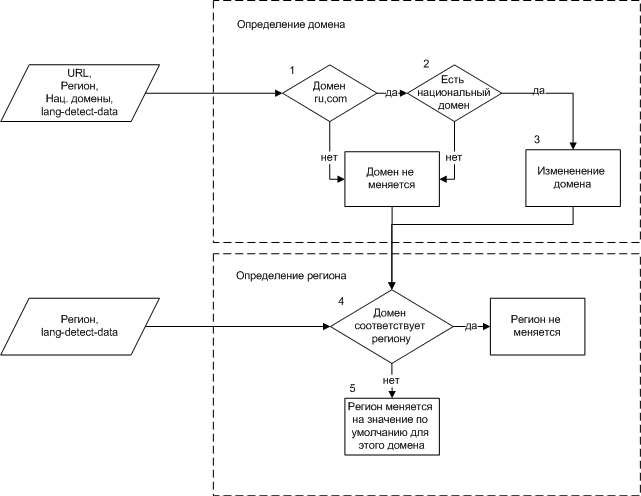
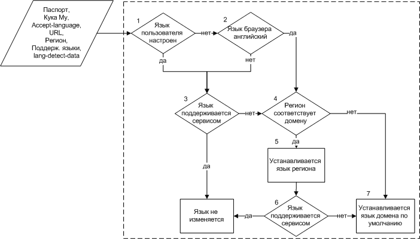

# Описание библиотеки

## Назначение {#intention}

Библиотека предназначена для определения домена, региона, языка страницы и списка релевантных языков пользователя.

## Реализация {#realisation}

Библиотека реализована на С++. Разработаны интерфейсы для [XScript](xscript-api.md), [Python](python-api.md), [Perl](perl-api.md), [С++](cplusplus-api.md) и [Node.js](nodejs-api.md).

## Установочные пакеты {#installation}

- `libyandex-lang-detect-data` — содержит файл `lang-detect-data.txt`;
- `libyandex-lang-detect` — содержит библиотеку;
- `yandex-lang-detect-python` — содержит биндинг для Python;
- `yandex-lang-detect-perl` — содержит биндинг для Perl;
- `xscript-yandex` — содержит `xscript-yandex.so`, которая включает в себя биндинг `lang-detect` в XScript;
- `libyandex-lang-detect-dev` — содержит заголовочные файлы для разработки на С++;
- `yandex-lang-detect-nodejs` — содержит биндинг `lang-detect` в Node.js.

## Общая логика {#common-logic}

### Состав входной информации {#common-logic}

При обработке запроса пользователя используется следующая информация:

1. Из HTTP-пакета:
    - Второй блок 39-го элемента куки [**my**](http://wiki.yandex-team.ru/MyCookie/NomerBloka), содержащий настройку языка пользователя. Этой информации может не быть, если пользователь отклоняет куки. Язык также может быть настроен на автоматическое определение. Для получения настройки можно использовать библиотеку **cookiemy**;
    - Поле **Accept-Language**, которое содержит перечень языков. Этот перечень настраивается в браузере как список предпочитаемых языков;
    - URL.
    
1. Из **Паспорта** [извлекаются](source-data.md) данные о языке пользователя;
1. Из Геобазы — регион, получаемый в виде списка числовых идентификаторов региона и его родителей. Например, <q>236,11119,40,225,10001,10000</q> — <q>Набережные Челны, Набережночелнинская агломерация, Республика Татарстан, Россия, Евразия, Земля</q>. В некоторых случаях регион может не определиться, например из-за того, что IP появился недавно. Для обращения к геобазе используется библиотека [libgeobase](https://docs.yandex-team.ru/libregional-units);
1. Определяемые разработчиками сервиса:
    - Перечень поддерживаемых языков, который используется как фильтр при определении языка отображения страницы и списка релевантных языков;
    - Язык сервиса по умолчанию. Используется в том случае, если библиотека не смогла ничего подобрать своей стандартной логикой (не обязательный параметр);
    
1. Содержимое файла `lang-detect-data.txt`, в т.ч. регион по умолчанию (как правило это столица) и язык домена по умолчанию (сервисом может не поддерживаться).

Входные параметры имеют различный приоритет. Наиболее приоритетными являются настройки пользователя из Паспорта, далее из куки `my`, затем настройки браузера и в последнюю очередь рассматриваются автоматически определяемые параметры. Используется максимально приоритетный из имеющихся (любой параметр может отсутствовать), а все менее приоритетные при этом уже не рассматриваются.

### Общий алгоритм {#common-logic}

Сервис, к которому обратился пользователь, должен с помощью `libgeobase` определить регион пользователя, затем с помощью `lang-detect`[определить домен](lang-detect-descr.md#domain-and-region) и проверить корректность ранее полученного региона, изменив его при необходимости. После этого, так же с помощью `lang-detect`, получить [язык отображения страницы](#page-lang) и [список релевантных языков](#lang-list).

### Определение домена и региона пользователя {#domain-and-region}

Для учета региональной специфики, используются специализированные домены: для Украины — `ua`, для Казахстана — `kz` и т.д. Если пользователи из этих регионов будут обращаться к доменам `ru` или `com`, библиотека выдаст рекомендацию изменить домен на национальный.

**Входные данные:**

- Регион пользователя, полученный из геобазы;
- URL;
- Перечень доменов для переадресации;
- Содержимое файла `lang-detect-data.txt`.

**Алгоритм:**

**Описание алгоритма:**

1. Если произошло обращение к домену `ru` или `com`, переходим к п.2. В противном случае домен не изменяется, переходим к определению региона.
1. Проверяется наличие национального домена для региона пользователя. Если такой домен существует, переходим к п.3. В противном случае домен не изменяется, переходим к определению региона. Например, если пользователь из Лондона обратился в домен `ru`, библиотека не изменит его значение, поскольку национального домена для Великобритании нет.
1. Домен изменяется на национальный. Например, если пользователь из Астаны обратился к домену `ru`, библиотека изменит его значение на `kz`. Домен `com` изменяется на `com.tr` (Турция). Домен `ru` изменяется на домены `ua` (Украина), `kz` (Казахстан), `by` (Беларусь).
1. Если домен соответствует региону, регион не изменяется. В противном случае переходим к п.5.
1. Регион изменяется на значение по умолчанию для этого домена. Например, если пользователь из Минска обратился к домену `kz`, домен изменен не будет, а регион будет изменен на Астану.

### Определение языка отображения страницы {#page-lang}

**Входные данные:**

- [Данные](source-data.md) из Паспорта о языке пользователя;
- Информация из куки `my`;
- Значение поля `Accept-Language` заголовка HTTP-пакета;
- URL;
- Регион пользователя, полученный из геобазы;
- Перечень поддерживаемых языков (определяется разработчиком сервиса);
- Язык сервиса по умолчанию (определяется разработчиком сервиса);
- Содержимое `lang-detect-data.txt`, в т.ч. язык домена по умолчанию.

**Алгоритм**

**Описание алгоритма**

1. Если язык пользователя настроен, т.е. настроен в Паспорте и/или куке `my` , то переходим к п.3. В противном случае переходим к п.2.
1. Если предпочитаемым языком в браузере настроен английский, переходим к п.4. В противном случае переходим к п.3. Английский язык игнорируется для всех доменов кроме `com`, `yandex-team.ru`.
1. Если язык сервисом не поддерживается, то переходим к п.4. В противном случае язык не изменяется.
1. Если регион соответствует домену, переходим к п.5. В противном случае переходим к п.7. В случае домена `ru` любой регион, для которого нет национального домена считается соответствующим.
1. Язык устанавливается как язык региона. Например, регион Татарстан принадлежит домену `ru`, но язык региона при этом является татарским.
1. Если язык сервисом поддерживается, то его значение не изменяется. В противном случае переходим к п.7.
1. Язык устанавливается как язык по умолчанию для домена (из файла `lang-detect-data.txt`). Считается, что если сервис запущен для какого-либо домена, он заведомо поддерживает язык домена по умолчанию.

Если по какой-либо причине описанная выше логика не дала результата — используется язык сервиса по умолчанию.

**Альтернативный алгоритм**

Помимо описанного выше алгоритма, у разработчика есть возможность применять модифицированный алгоритм, который:

- не проверяет соответствие региона домену (п.4 основного алгоритма), и, соответственно, не требует URL на входе;
- не игнорирует английский язык в отличие от п.2 основного алгоритма;
- в блоке 7 использует язык сервиса по умолчанию, а не язык домена из файла `lang-detect-data.txt`.

### Определение списка релевантных языков {#lang-list}

При построении списка релевантных пользователю языков используются те же параметры, что и при определении языка отображения.

**Описание алгоритма:**

1. Составляется список из всех языков, встречающихся во входных параметрах.
1. Из полученного списка остаются только те языки, которые присутствуют в перечне поддерживаемых языков сервиса.

