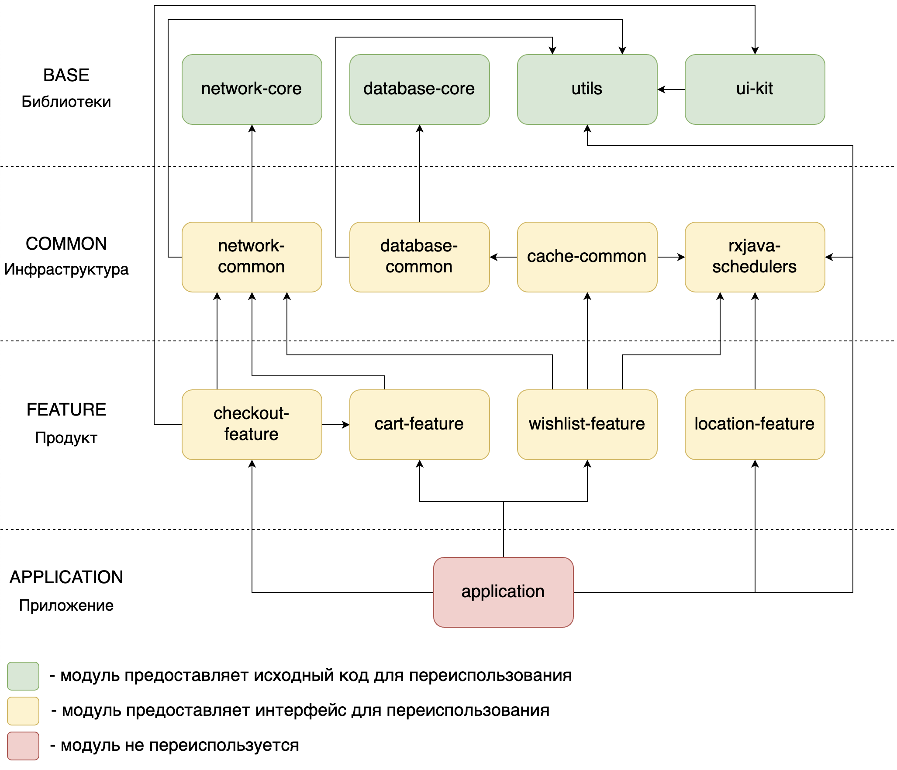

# Модульность

## Зачем нужна модульность
* Уменьшает время компиляции приложения (горячей и холодной)
* Повышает степень изолированности фичей в приложении (уменьшает зацепление кода)
* Усиливает возможность переиспользования кода (как внутри приложения, так и в рамках других приложений)

## Преимущества модульности
1. Быстрее собираемся - быстрее разрабатываемся - быстрее выпускаем фичи
2. Повышаем изолированность кода - уменьшаем связность фичей - сажаем меньше багов и быстрее их локализуем
3. Создаем контракт для фичи - работаем с декларативным описанием фичи - безопасно заменяем реализацию фичи
4. Раскладываем код по своим местам - знаем где искать нужный нам код - находим и переиспользуем код, а не пишем его заново
5. Пишем более гранулярный код - работаем с небольшими файлами - открываем дорогу к `Trunk Based Development`

## Плагин для работы с модулями
Для более удобной работы с модулями написан плагин, который позволяет добавлять и удалять модули за пару кликов.

[Репозиторий плагина](https://a.yandex-team.ru/arcadia/mobile/market/tools/android-market-plugin)

[Инструкция по установке](https://a.yandex-team.ru/arcadia/mobile/market/tools/android-market-plugin/README.md#how-to-install)

## Типы модулей
### Base модуль
Представляет собой модуль-библиотеку с исходным кодом для переиспользования. Никак не завязан на продуктовые фичи, может быть переиспользован в другом приложении. Примером такого модуля может служить обертка для работы с базой данных или набор утилит общего назначения. Может зависеть напрямую только от других **base** модулей.
### Common модуль
Предоставляет зависимости общего характера, не привязанные к продукту. Предполагается переиспользование только в рамках приложения Яндекс.Маркет. Может содержать знания о специфике приложения, например о реарр-флагах. Может зависеть напрямую только от **base** и других **common** модулей.
### Feature модуль
Предоставляет зависимости для конкретной фичи, может использовать другие фичи в качестве внешней зависимости. Предоставляет data, domain или presentation слой фичи в качестве публичного api. Может зависеть напрямую от **base**, **common** и других **feature** модулей.
### Application модуль
Соединяет все фичи приложения воедино. Максимально тонкий модуль, потому что пересобирается каждый раз. Может зависеть напрямую от любых типов модулей.
### Core модуль (в разработке)
Модуль, содержащий часть кода ядра приложения. К коду в данных модулях предъявляются повышенные требования, обязательно ревью кор-команды. Если в хотите что-то сюда добавить, вам скорее всего в `Base`.

## Структура приложения
**ВАЖНО!** Это лишь пример графа модулей для демонстрации связей между типами модулей, названия модулей в нем не соответствуют модулям в реальном проекте.

## Декомпозиция и коммуникация фичей
* Каждый **feature** модуль может предоставлять только один слой в качестве публичного api. Например, модуль может предоставлять **domain** слой фичи, но в таком случае **data** слой фичи должен быть инкапсулирован в этом же модуле либо вынесен в отдельный модуль и подключен как внешняя зависимость к данному модулю.
* **Domain** модуль предоставляет юзкейсы, которые могут использоваться как **presentation** модулями, так и другими **domain** модулями.
* **Data** модуль предоставляет реализацию репозиториев, которые могут использоваться несколькими **domain** модулями.
* **Feature** модуль предоставляет реализацию презентера или фрагмента (зависит от того, получилось ли вынести фрагмент).
