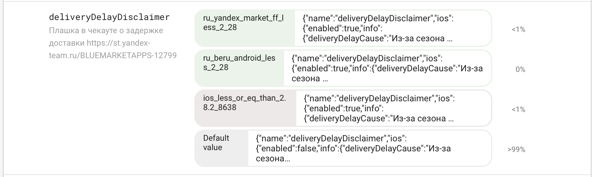
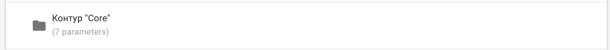
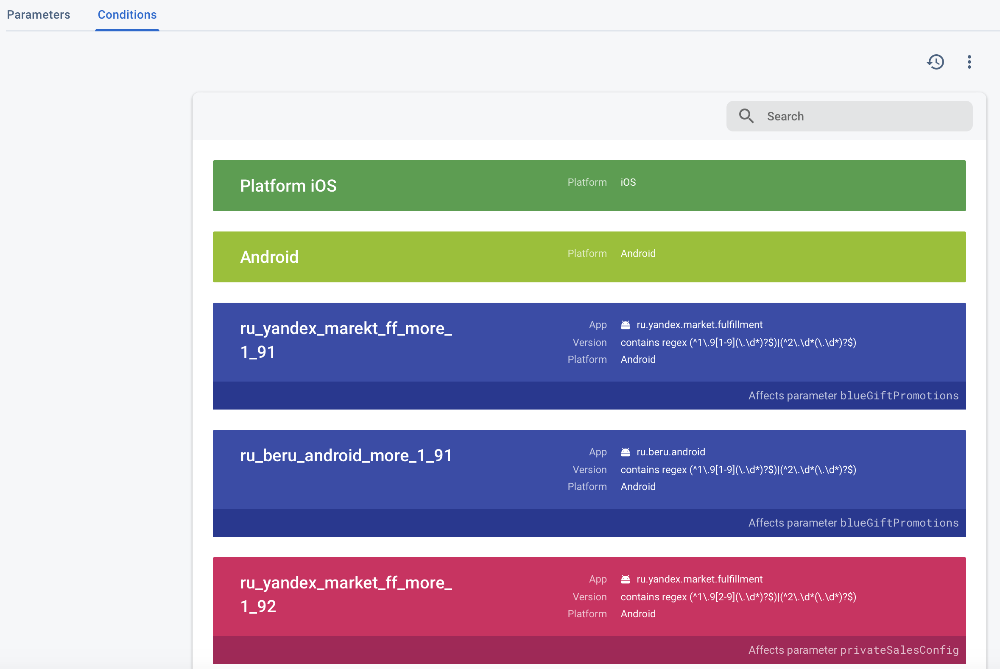
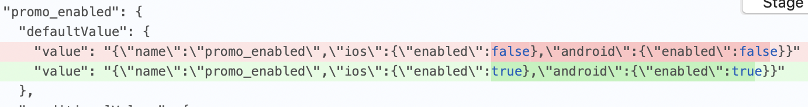
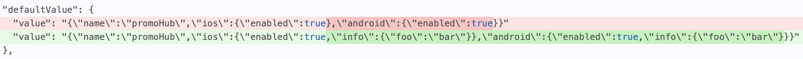
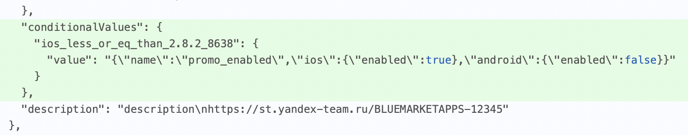



- Через веб-интерфейс Арканума

    Отредактировать файл по ссылке из П.1 согласно правилам ниже
    

- Через Аркадию 

    Актуальное значение конфига лежит по пути:
    ```
    market/mobile/beru/remote_configurator/remoteConfig.json
    ```
    Чтобы изменить значение тоглов в Firebase нужно отредактировать этот файл по правилам ниже



---

*Полную документацию по формату конфига можно найти вот [здесь](https://firebase.google.com/docs/reference/remote-config/rest/v1/RemoteConfig?hl=ru).*

#### Термины:

- `feature toggle == parameter`. Имеет значение дефолтное значение и может иметь условные. 

    

    

    

- `Paramter group` - группа, объединяющая параметры одного контура / функциональности.

    

    

    

- `Conditions` - набор правил по которым можно сегментировать значения параметров. (поддерживается настройка по версиям /номеру сборки и тд).

    

    

    

#### Дополнительно к правилам, определенным по ссылке выше, у нас существует еще несколько (все проверяются юнит тестами на пр-ах):

* Параметры должны добавляться в одну из имеющихся (или в новую) группу параметров. Нельзя добавлять определять параметры вне групп.
* Количество ключей в конфиге должно быть равно 3: `[conditions, version, parameterGroups]` 
* Правила из conditions должны содержать ключи `name` и `expression`  + опционально `tagColor` из набора

    

    ```json 
    'CONDITION_DISPLAY_COLOR_UNSPECIFIED',
    'BLUE',
    'BROWN',
    'CYAN',
    'DEEP_ORANGE',
    'GREEN',
    'INDIGO',
    'LIME',
    'ORANGE',
    'PINK',
    'PURPLE',
    'TEAL'
    ```
    

* Значение групп параметров (по ключу parameterGroups) - JSON
* Параметр обязательно должен содержать значение `defaultValue`
* Если для параметра определено условное значение (`conditionalValues`) - это условие должно быть определено в conditions конфига
* Параметр должен содержать `description`, включающий ссылку на тикет (предпочтительнее BMP):
    * `https://st.yandex-team.ru/BLUEMARKETAPPS-`
    * `https://st.yandex-team.ru/BMP-`
    * `https://st.yandex-team.ru/MARKETPROJECT-`
* Значение поля `description` в параметре не должно быть длиннее 100 символов
* Значение параметра должно быть JSON-ом в виде экранированной строки
* JSON значения параметра должен содержать поле name, совпадающее с ключом, по которому определен параметр
* В JSON-е значения параметра по ключам ios и android должны быть значения:
    ```json
    "enabled": true|false
    "info": {:}  (optional)
    "fromVersion": "2.4.2" (optional)
    ```

#### Типичные задачи

##### Включить существующий тогл
Заменить `enabled = false` на `true` для обеих платформ



  




##### Добавить тогл

Внутри одной из группы параметров добавить следующий json (не забыть про запятую в начале при необходимости):
```json 
"test_toggle": {
  "defaultValue": {
    "value": "{\"name\":\"test_toggle\",\"ios\":{\"enabled\":true},\"android\":{\"enabled\":false}}"
  },
  "description": "Test toggle.\nhttps://st.yandex-team.ru/BLUEMARKETAPPS-12345"
}
``` 

##### Добавить info в тогл

Внутри каждой платформы добавить JSON (только `{key:value}`. массивы, литералы не поддерживаются) по ключу `info` экранированной строкой.



  



##### Добавить условный тогл

В массив conditions добавить объект с уникальнм name (полная документация по формату [здесь](https://firebase.google.com/docs/reference/remote-config/rest/v1/RemoteConfig?hl=ru#RemoteConfigCondition):

```json
{
  "name": "ios_less_or_eq_than_2.8.2_8638",
  "expression": "device.os == 'ios' && app.build.matches(['(^([0-7]{0,1}[0-9]{0,1}[0-9]{0,1}[0-9]{0,1}|8[0-6][0-3][0-8]){1}$)'])",
  "tagColor": "TEAL"
}
```

Для нужного тогла помимо `defaultValue` добавить значение в `conditionalValues` по ключу равным полю `name` из определения выше.



  



