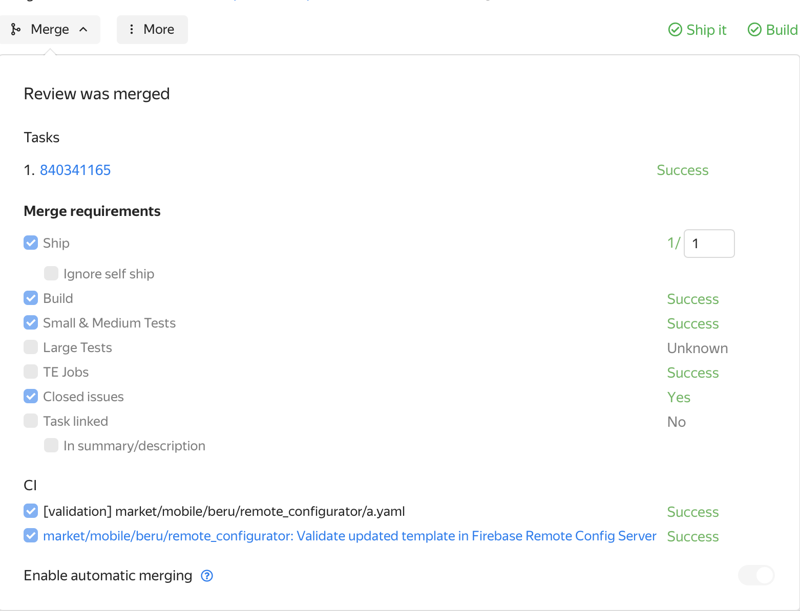

Ревьюеры назначаются автоматически через codereview bot. На пр-е также запускается валидация конфига в Firebase - проверить, что она прошла можно в выпадающем меню `Merge`. 



галка `Validate updated template in Firebase Remote Config Server` должна быть в статусе `Success`



---

После заливки коммита в транк автоматически запустится релиз в CI - в ходе которого произойдет заливка изменений в FIREBASE + коммит инкремента версии обратно в Аркадию.

Последить за релизом можно вот [здесь](https://a.yandex-team.ru/ci/beruapps/releases/timeline?id=remote-config-release&dir=market%2Fmobile%2Fberu%2Fremote_configurator)
