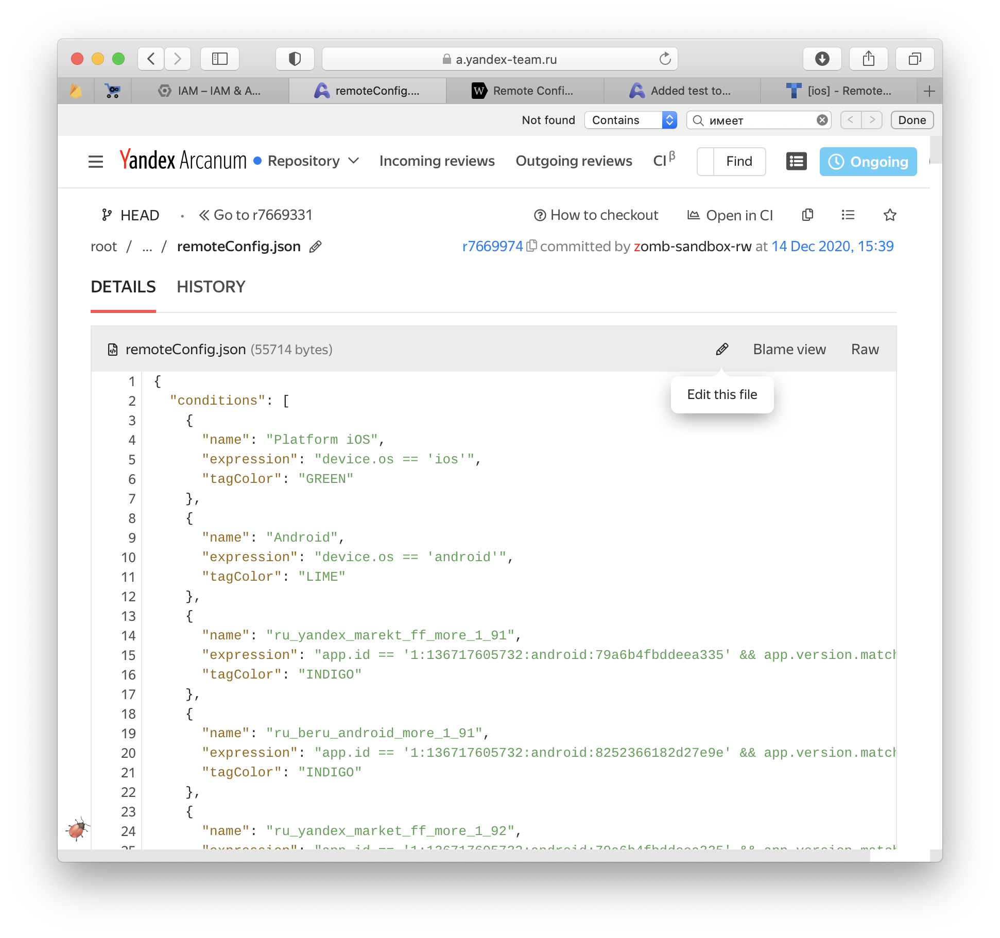

- Проверьте, что вы состоите в ABC сервисе [Мобильные приложения Яндекс.Маркет](https://abc.yandex-team.ru/services/beruapps/) и запросите права, если нет
- Создайте тикет в очереди BLUEMARKETAPPS на реализацию тоггла. Укажите в тикети для чего будет исопльзоваться данный тоггл




- Через веб-интерфейс Арканума

  * Открыть [страницу](https://a.yandex-team.ru/arc/trunk/arcadia/market/mobile/beru/remote_configurator/remoteConfig.json?edit=true)
  * Нажать **Edit This File**
    

- Через Аркадию 

  [Поставить Аркадию](https://doc.yandex-team.ru/arc/setup/arc/install.html) 
  или: 
  
  * Поставить Arc VCS из Self Service
  * Смонтировать аркадию:
    ```bash
    cd ~/
    mkdir -p arc && cd arc
    mkdir -p arcadia store
    arc mount -m arcadia/ -S store/
    ```  
  * Обновить транк:
    ```bash
    cd arc/arcadia/
    arc co trunk
    arc fetch trunk
    arc pull trunk
    ```
  * Создать ветку: `arc co -b BLUEMARKETAPPS-номер_тикета` 


