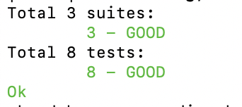


 
- Через веб-интерфейс Арканума

    До создания Pull Request-а - не получится.

- Через Аркадию 
 
    ```bash
    ya make -t market/mobile/beru/remote_configurator/
    ```
    Должно быть все зеленое:

    

    Те же тесты прогоняются на пр-ах, так что запускать их локально - необязательно, но это сэкономит время в случае некорректности файла.


