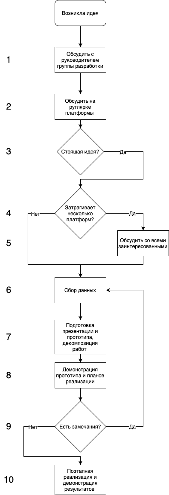

# Инструкция по работе с активностями Маркета



Этот документ находится в проработке и еще не утвержден.



---

## Проблема

У разработчиков часто возникает желание улучшать и модернизировать некоторые части проекта.

Зачастую, предлагаемые решения пересекаются с проектами команды инфраструктуры и эти работы могут быть запланированы или уже в работе. 

Так же, возникают случаи, когда у нескольких сотрудников возникает идея модернизировать один и тот же участок кода/приложения. 

Еще одним важным аспектом является добавление работ по задаче или проекту до конца. 



Для упрощения предлагаю в данном документе называть такие работы **"проект"**.

Каждый проект должен относиться к одному из [стримов](https://st.yandex-team.ru/dashboard/46712).



Можно выделить следующие аспекты проблемы:

1. Отсутствие прозрачности и статуса по проектам
2. Низкий уровень ответственности за проекты
3. Контроль качества выполняемых работ по проектам

## Решение

Любой сотрудник может создать новый проект. Для этого необходимо получить мнение коллег: если несколько коллег поддерживают инициатора в том, что существует проблема, которую можно исправить и улучшить, то инициатор создает тикет с кратким описанием и название проблемы. 

Важность проблемы определяется тем насколько сильно данный проект затрагивает участников команды и влияет на бизнес. Так же, уровень важности проблем необходимо согласовать с руководителем контура инфраструктуры, если данная проблема или проект находится в зоне ответственности этой команды.

### Создание тикета

Через форму [ссылка на форму скорее всего marketprojects] создается тикет на новый проект, где указывается: 

- Платформа
- Стрим
- Исполнитель [опционально]
- Куратор проекта (руководитель разработчика, который помогает ему с выполнением проекта) [опционально]
- [Цель](https://goals.yandex-team.ru)
- Приоритет
- Краткое описание 
- Примерная оценка в неделях 
- Ссылка на wiki [опционально]
  
  

    Для больших проектов рекомендуется заводить отдельную страницу в вики, где более подробно расписывать проблемы, ссылки на реализуемый код в репозитории, дополнительную информацию и результаты исследований.

  

### Ведение проекта

Если инициатор готов дальше заниматься данным проектом, то он может завести страницу в вики и прикрепить ее к задаче, а так же завести [цель](https://goals.yandex-team.ru) и прорабатывать ее. 

В этом случае в тикете необходимо дополнить: 

* Детальное описание проекта
* Какие проблемы решает данный проект
* Примерный срок реализации проекта
* Декомпозиция проекта. 
  
  

    Глубина декомпозиции должна быть такая, чтобы каждый этап проекта был измерим и достижим.
    
    Рекомендуется разбить проект на подзадачи так, чтобы каждая задача была измерима и достижима. 
    
    Если нет возможности сразу разбить весь проект на подзадачи, то рекомендуется выделить начальные этапы, выполнение которых позволит проводить дальнейшую декомпозицию. 

  
  

### Алгоритм работы

У сотрудника возникает идея реализации некого проекта, который позволит улучшить кодовую базу проекта или внести новшества в рабочий проект. Для себя сотрудник оценивает этот проект как персональную цель.



Если у сотрудника нет своих идей, но есть желание внести посильный вклад в улучшение проекта, то в этом случае так же можно обратиться списку "свободных" проектов





Если у сотрудника есть свои идеи, но нет возможности или желания брать данную идею как персональную цель, то в этом случае, он так же может создать тикет для проекта своей идеи



#### 1. Обсуждение с руководителем

Сначала нужно ознакомиться со списком уже имеющихся проектов: вероятно, данная идея уже возникала у коллег и данным проектом уже кто-то занимается. Вероятно, этот проект уже в работе у команды инфраструктуры или в планах. 

Если данным проектом уже занимается кто-то из сотрудников, и тот проект достаточно большой у трудоемкий, то для достижения более быстрого результата можно объединить усилия и совместно выполнить данный проект. Если проект небольшой или подходит к завершающей стадии, то стоит поискать другой проект. 

Если проекта нет в таблице или никто не занимается похожим проектом, то необходимо обсудить этот проект с руководителем. Вероятно, у руководителя есть информация и мысли по поводу предложенного проекта и он, может быть, в работе или по каким-то причинам был отклонен ранее. 

Если у руководителя нет причин отклонить предложенную идею, то можно переходить на следующий шаг.

#### 2. Обсуждение на регулярке платформы

После получения фидбэка у руководителя, необходимо обсудить данную проблему или проект на одной из регулярных встреч платформы и обсудить данный вопрос. 

Цель данного обсуждения: понять, насколько актуальна данная проблема, понять ведутся или уже велись работы по данной проблеме ранее. Результатом встречи должно быть понимание нужно ли дальше развивать эту идею или нет. Так же, по результату такого обсуждения, можно получить дополнительный фидбэк о идее и поинты, которые стоит учесть при подготовке и реализации данного проекта.

#### 3. Стоящая идея

По результату обсуждения с командой может выяснится, что идея проекта не актуальна или вносит небольшой импакт на участников проекта. В этом случае, стоит отказаться от идеи или понизить ей приоритет так как она менее значима. В этом случае, стоит перейти к поиску другой идеи.

#### 4-5. Затрагивание нескольких платформ

Возможна ситуация, когда предложенный проект может затрагивать несколько платформ маркета. В этом случае каждый отдельный проект рассматривается индивидуально на более высоком уровне по причине возможных повышенных трудозатрат и влияния на план-график выпуска релизов. Каждый такой проект разбирается индивидуально и по нему принимается решение о необходимости реализации.

Если проект не затрагивает несколько платформ, то возможно, что на "соседней" платформе уже сталкивались с проблемой и уже проработаны идеи реализации похожего проекта. В этом случае не будет лишним получить экспертизу у смежной команды, уточнить с какими проблемами они столкнулись, как реализовывали данный проект и на какой стадии он находится сейчас. Вероятно, часть или все наработки можно будет переиспользовать.

#### 6. Сбор данных

Если проект предполагает внесение правок в текущую кодовую базу, то необходимо провести исследование, как правки повлияют на текущее решение и какие компоненты могут быть затронуты. На этом шаге стоит определить риски внесения правок, понять какие компоненты могут быть затронуты, составить план тестирования и покрытия тестами затронутого кода. Этот анализ позволит оценить трудоёмкость реализации проекта. 

Изучение кодовой базы позволит обнаружить дополнительные проблемы и сложности в реализации проекта, которые не были видны изначально. Данных, собранных при изучении и погружении в проект, будет достаточно для составления презентационных материалов по реализации проекта и формированию плана. 

Так же, стоит отменить, что на этом шаге необходимо рассмотреть все альтернативные решения данного проекта: найти готовые решения, изучить решения конкурентов на профильных ресурсах, а также поинтересоваться как решался данный проект у других команд Яндекса

По результату набора решений, стоит определить свой собственный вектор развития исходя из ограничений, проблем и найденных решений. На этом этапе возможно, что большая часть решения будет взята уже как готовая, но с адаптацией под конкретный продукт.

#### 7. Подготовка презентации

По результатам анализа кодовой базы и опыта решения проблемы другими командами необходимо сформировать целостную картину реализации проекта. 

Если информации по проекту много, то рекомендуется оформить отдельную страницу в вики со ссылкой на эту страницу в таблице проектов. На этой странице следует собрать всю необходимую информацию о проекте.
Так же, необходимо подготовить презентацию, которая содержит:

- Проблемы, которые сейчас есть
- Улучшения, которые будут сделаны в рамках проекта
- Обзор альтернативных решений
- Целевое решение
- Примеры кода и прототипы

На этом этапе проект должен быть разбит на этапы. Каждый этап должен быть измерим и достижим.

#### 8. Демонстрация прототипов

В рамках встречи команды необходимо провести презентацию и защиту проекта. 

На этапе защиты проекта необходимо согласовать реализацию проекта с руководителем контура инфраструктуры

После защиты необходимо приступать к реализации проекта.

#### 9. Сбор замечаний

В процессе защиты, могут быть указаны дополнительные нюансы, замечания и уточнения, которые должны быть учтены при реализации проекта. 

Лучше всего конспектировать замечания на странице проекта в вики с пометкой учтено ли данное замечание или отклонено с указанием причины отклонения.

#### 10. Реализация проекта

После получения всех согласований необходимо приступать к реализации проекта. Так как проект разделен на итерации, то можно выпускать небольшие обновления со сбором фидбэка со всех заинтересованных и внесением дополнительных корректировок в процессе разработки. Так же, стоит не забыть про страницу проекта и содержать ее в актуальном состоянии.

Стоит обратить внимание, что после завершения проекта, разработчик, являясь источником знаний, остается первое время ответственным за реализованный функционал и должен оказывать помощь и поддержку по реализованному проекту, либо передать данный проект в ответственность команде или сотруднику.

#### Прочее

Если разработчик или группа разработки решила прекратить работу над тем или иным функционалом, то в первую очередь стоит понять причину, по которой прекратилась работа.

1. **Проект потерял актуальность.** Если проект потерял актуальность, то нужно понять, почему руководителями не был учтен данный риск при старте работ над проектом. Если риск действительно не был учтен, то стоит провести работу с руководителями, давшими согласие на реализацию данного проекта, чтобы избежать данных ситуаций в последующем. Есть риск был учтен, и проект стал неактуален по вине внешних факторов, то такая ситуация считается нормальной. 

   В случае потери актуальности проект стоит заморозить с указанием в таблице причин остановки работ по проекту.

2. **Разработчик перестал заниматься проектом.** В этом случае следует организовать передачу проекта другому разработчику в случае если проект критичен. Так же, если проект не слишком критичный, то можно временно приостановить работы над проектом на определённый срок, а по завершению этого срока, либо вернуться к работам, либо передать проект другому разработчику.

3. **Разработчику нахватает компетенций.** Если проект сложный, и разработчик не чувствует уверенности в своих силах или понимает (боится), что его знаний недостаточно для качественного выполнения достижения поставленной цели, то в этом случае можно предложить другим разработчикам помочь с реализацией данного проекта, чтобы совместными усилиями достичь желаемого результата.

#### Поинты успешного проекта

- Согласование с руководителем
- Согласование с инфраструктурой командой
- Презентация команде
- Ведение страницы проекта
- Заведение проекта в личные цели с указанием срока выполнения
- Декомпозиция проекта
