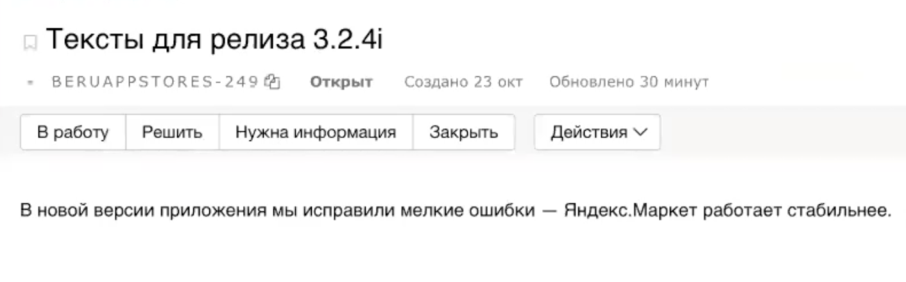
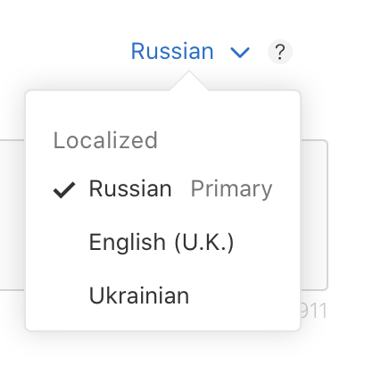

# Поэтапная раскладка релиза

Релиз заливается поэтапной раскладкой в сторы, чтобы избежать раскатки проблемной версии на всю аудиторию. Раскладка выполняется дежурным публикатором ([график дежурств](https://abc.yandex-team.ru/services/beruapps/duty/?role=2511)).

День | Раскатка
:--- | ---:
1 | 1%
2 | 2%
3 | 5%
4 | 10%
5 | 20%
6 | 50%
7 | 100%

## Тикет публикации



## Процесс публикации приложения в App Store

Новую версию приложения можно публиковать после создания тикета публикации **и прохождения ревью от одного из лидов платформы**.

### Приложение в App Store Connect
Зайти в ([App Store Connect](https://appstoreconnect.apple.com)) и выбрать приложение “Яндекс.Маркет“. На странице приложения отображена информация о последней опубликованой версии в статусе “Ready for sale”.

### Создание новой версии
Необходимо нажать на “+” над номером текущей версии и статусом.

В открывшемся окне ввести номер новой версии, который указан в названии релизного тикета. Номер версии должен быть в формате “3.2.4”, без “i”.

После нажатия на кнопку “Create” будет заведена страница для новой версии приложения в статусе “Prepare for submission”.

### Подготовка контента

#### Version Information
Текст с инфо о новой версии находится в тикете, который можно найти через джобу релизного пайплайна:
ЦУМ —> пайплайн текущего релиза —> джоба с названием “Создаем тикет для текстов в store” —> тикет с текстом.

Текст необходимо добавить для каждого из 3х языков (на русском).

После добавления текста нажать “Save”.

#### Build
**Номер сборки для публикации нужно брать из TeamCity через джобу релизного пайплайна:**
ЦУМ —> пайплайн текущего релиза —> джоба с названием “Сборка Store” —> TeamCity.

Сборка может быть недоступна для выбора в течение часа после заливки.

После выбора сборки нажать “Save”.

#### Version Release
Выбрать вариант “Automatically release this version”. После завершения ревью сборка сразу опубликуется.

#### Phased Release for Automatic Updates
Выбрать вариант “Release update over 7-day period using phased release”. Сборка будет раскатываться поэтапно.

#### Reset iOS Summary Rating
Выбрать вариант “Keep existing rating”. Рейтинг останется прежний.

### Отправка на ревью и дальнейшая раскатка
1. Проверить, что все заполнено правильно.
2. Нажать на кнопку “Submit for Review”.
3. Нажать в тикете публикации кнопку **Опубликовал**
4. Следить за отчетами в telegram или тикете публикации (пристально следить за крешфри)
5. При достижении аудитории в 20.000 активных пользователей с допустимым крешфри проверить отзывы
6. Если с отзывами и крешфри все хорошо, опубликовать версию на 100%
7. Нажать в тикете публикации кнопку **Раскатил на 100%**

[ссылка на вики](https://wiki.yandex-team.ru/users/artemafk/process-publikacii-prilozhenija-v-app-store/)
