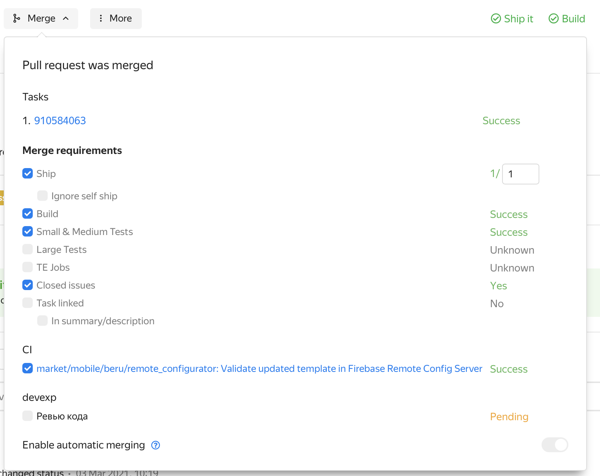
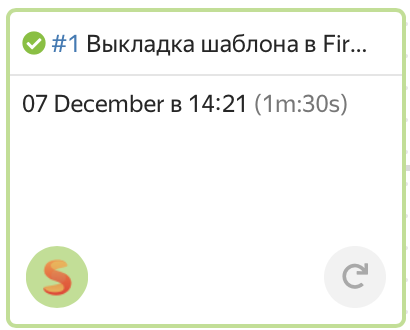
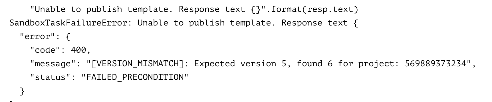
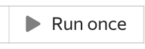

[ссылка на вики](https://wiki.yandex-team.ru/users/rkendzhaev/remoteconfigurator/)

## Что такое Feature Toggle 

Feature Toggle - это механизм, который позволяет включать или отключать фичи или логику приложения, без обновления версии приложения и выкладывания в сторы релиза. 



Рекомендуется посмотреть [доклад](https://frontend.vh.yandex.ru/player/473a7d11aac2892db37d6e40e9f431c8) про тогглы 



## Как это работает

С помощью Firebase ReomteConfig создан файл конфигурации, в котором содержится: 
- Перечень фич в приложении
- Статус для каждой фичи (включена или выключена)
- Версии, для которых применяются правила включения и выключения (для одних версий приложения фича может быть включена, для других выключена)
- Прочая информация (см. описание ниже)

На стороне приложения, если есть необходимость закрыть какую-то фичу тогглом, то ставится специальная проверка, которая включает или выключает (отображает или не отображает) функциональность. 

На старте приложение выкачивает новый конфигурационный файл из Firebase ReomteConfig и сохраняет его локально. В процессе работы, с помощью специальных механизмов в коде проверяется доступна ли функциональность для данной версии приложения. Если фича доступна, то пользователь может ей пользоваться, если нет, то он даже не знает о ее существовании. 

## Для чего это нужно

Чаще всего это необходимо в следующих случаях: 

1. Критичный функционал, который может привести к проблемам или ошибкам рекомендуется выкатывать по тогглом. Тогда его можно будет удаленно отключить через тоггл. 
2. Эксперименты дополнительно покрываются тогглами, чтобы была возможность их включать и выключать. 
3. Новый функционал, который недостаточно протестирован и может привести к нестабильной работе приложения

## Последовательность действий при управлении фича тоглами

Ниже описан порядок действий для реализации тоггла. Реализация тоггла на платформах описана в соответствующих разделах: 
- [iOS](https://docs.yandex-team.ru/market-mobile/ios/remote-configuration)
- [Android](https://docs.yandex-team.ru/market-mobile/android/remote-configuration)

### 1. Подготовка



### 2. Изменение конфигурации



### 3. Прогон тестов



### 4. Создание PR



### 5. Завершение 



## В случае экстренных ситуаций

Если вам нужно срочно обновить конфиг и нет времени ждать, когда пройдет ревью - можно вливать ПР без обязательных проверок. Для этого нужно снять галки в попапе Merge напротив соответствующих пунктов: 







- Чтобы залить пр **без код ревью** нужно снять галки Ревью кода `(в секции devexp)` и `ship`
- Чтобы залить пр **без тестов** (не рекомендуется) нужно снять галки `Build` и `Small&Medium Tests`

## Возможные проблемы

#### 1. Пр влит, но отбивки в чат не приходит (есть подозрения, что изменения не применились)
Проверь, что релиз запустился на [CI](https://a.yandex-team.ru/projects/beruapps/ci/releases/timeline?dir=market%2Fmobile%2Fberu%2Fremote_configurator&id=remote-config-release) и если для твоего коммита релиза не было - значит глюканул автозапуск и нужно нажать `Run Release`

#### 2. Первый кубик в релизе краснеет



Плюс по ссылке из кубика в Sandbox аналогичная:



Значит кто-то обновил конфиг через Firebase веб консоль. Нужно пройти по [ссылке](https://sandbox.yandex-team.ru/scheduler/43236/view) и нажать `Run once`



Далее запустится таска, которая скачает обновленный конфиг из Firebase и запушит в транк через пулл реквест с прогоном тестов. (в логах таски будет ссылка на пр) Нужно поставить ок пр-у.
После нужно будет обновить ветку по транку:
```bash
arc fetch trunk
arc pull trunk 
arc rebase --onto trunk
```
Плюс скорее всего порешать конфликты со своими изменениями или накатить их заново. 

Вывод:
**Не обновляйте конфиг через веб консоль - это приносит лишние проблемы другим людям. 
Если все-таки пришлось:**
1. Запускайте 1 раз [таску](https://sandbox.yandex-team.ru/scheduler/43236/view)
  
    
2. После успешного выполнения таски - необходимо найти созданный таской пулл реквест [по ссылке](https://a.yandex-team.ru/arc/pull-requests/trunk/arcadia/market/mobile/beru/remote_configurator?filter=open%28true%29%3Bpublished%28true%29%3Bpath%28%2Fmarket%2Fmobile%2Fberu%2Fremote_configurator%29&sort=-updated_at)
3) Пулл ревест нужно окнуть (нажать Ship)

## Полезные ссылки 

- [Доклад про тогглы](https://frontend.vh.yandex.ru/player/473a7d11aac2892db37d6e40e9f431c8)
- [Актуальный конфиг](https://a.yandex-team.ru/arc/trunk/arcadia/market/mobile/beru/remote_configurator/remoteConfig.json )
- [Репозиторий](https://a.yandex-team.ru/arc/trunk/arcadia/market/mobile/beru/remote_configurator)
- [CI (Релизы)](https://a.yandex-team.ru/ci/beruapps/releases/timeline?id=remote-config-release&dir=market%2Fmobile%2Fberu%2Fremote_configurator)
- [Пулл реквесты в репозиторий](https://a.yandex-team.ru/arc/pull-requests/trunk/arcadia/market/mobile/beru/remote_configurator)
- [Sandbox таски на публикацию конфига](https://sandbox.yandex-team.ru/tasks?children=true&type=MARKET_MOBILE_UPLOAD_REMOTE_CONFIG_TASK&limit=20&created=14_days)
- [Документация по формату файла-конфига](https://firebase.google.com/docs/reference/remote-config/rest/v1/RemoteConfig?hl=ru#RemoteConfigCondition)


