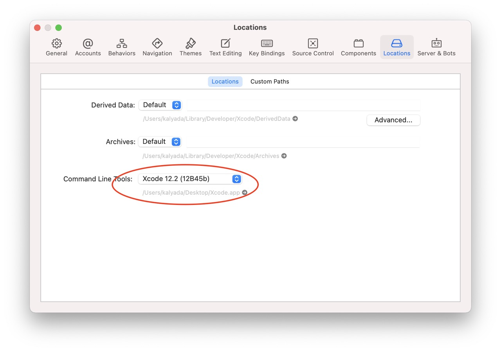

# Поздравляю, ты стал iOS разработчиком в команде Яндекс.Маркет!

## 1. Необходимое ПО

* Xcode - ide в которой мы пишем код
* Telegram - основной инструмент коммуникации с командой
* Charles или ([Proxyman](https://proxyman.io)) - инструмент для отладки сетевых запросов

## 2. Дополнительное ПО
* Figma - инструмент для работы с макетами ([доступ тут](https://wiki.yandex-team.ru/figma/))
* Postman - инструмент для тестирования энпоинтов
* SublimeText - для удобной работы с текстовыми файлами
* Slack - некоторые команды в Яндексе работают в Slack
* Git клиент (например Fork) - если не устраивает встроенный в Xcode плагин или консольная утилита
* AppMetrica - инструмент для работы с метриками приложения (id приложения=1389598, тестовое приложение 2780002) ([доступ тут](https://wiki.yandex-team.ru/yandexmobile/appmetrica/akkaunty-i-dostupy/menedzherskijj-dostup-v-appmetrica/#dostuptolkokodnomuprilozhenijujandeksa))



Доступ к AppMetrica запрашивать **"Просмотр"**



## 3. Твоя страница на стаффе

* Укажи логин в телеграмме



Укажи логин, как рабочий. Иначе код-ревью бот не будет тебе писать


* Укажи место, где ты сидишь
* Привяжи почту на yandex.ru (не yandex-team.ru)
* Создай ssh-ключ для доступа к внутрисетевым ресурсам. Подробнее [тут](https://wiki.yandex-team.ru/diy/macos/ssh/) или [тут](https://wiki.yandex-team.ru/security/ssh/macos/?from=%2Fdoc-and-loc%2Fdoc%2Fnewbies%2Fmac%2Fssh-authentication-keys%2F)
* На своей странице ты можешь найти своего руководителя, информацию о подразделении и тд

## 4. Настройка проекта

* Скачай проект из репозитория [https://arcanum.yandex-team.ru/arc_vcs/mobile/market/ios/app-market](https://arcanum.yandex-team.ru/arc_vcs/mobile/market/ios/app-market)
* Установи Command Line Tools 
* Озакомься с гайдом,  но который идет в файле README.md проекта.
* Следуй инстркции в README.md файле.
* Напиши боту [@codereview_bot](https://t.me/codereview_bot) в телеграмме `/start` и добавьтесь в канал [Angry Robot](https://t.me/joinchat/wf6O0bi4m6ZhMWMy)
* Напиши боту [@TSUMYandexBot](https://t.me/TSUMYandexBot) в телеграмме `/start`

## 5. Чаты и встречи

Обязательно попроси ментора добавить тебя во все необходимые чатики и встречи.

Основные чаты:
* Яндекс.Маркет iOS - только iOS разработчики Маркета
* Мобильная разработка и QA Маркета - разработка ios, разработка android, тестировщики
* Релизы мобилок Маркета - рабочий чат по выпуску релизов ios/android
* MarketMobile - общий чат-приемная мобилок

Встречи:
* Назначаются в [календарь](https://calendar.yandex-team.ru/)
* По пятницам в 17:00 встречаемся командой iOS разработчиков. Обсуждаем интересные проекты, важные вопросы по проекту, холиварим и договариваемся о каких-то вещах.
* Подпишись на рассылку [https://ml.yandex-team.ru/lists/market-mobile-dev/](https://ml.yandex-team.ru/lists/market-mobile-dev/)



Команда постоянно проводит встречи и делится новостями, рассказывает интересные вещи. По каждой встрече ведется запись, поэтому можно посмотреть записи встреч [тут](https://wiki.yandex-team.ru/users/dmpolyakov/poleznosti-s-ezhenedelnojj-vstrechi/)



## 6. Почитай о терминологии Маркета

* [Словарь маркета](https://wiki.yandex-team.ru/Market/frontend/development/concepts/)
* [Словарь разработчика](https://wiki.yandex-team.ru/market/mobile/marketapps/dev-dictionary/)

## 7. Взаимодействие с Ментором

Нужно убедиться что в рамках первых двух недель взаимодействия, ментор расскажет про следующий список тем:
- Покажет приложение. Посмотрите на основные разделы и примерный список фичей с основной терминологией(выдача, морда, чекаут, кт и т.д.)
 Проговорит основную архитектуру и покажет несколько мест где можно смотреть примеры
- Расскажет про способ верстки экранов - formKit
- fapi vs capi (vs mapi) зачем и почему?
- Как мы работаем с тикетами(как оформлять пр, двигать пайплайн, разбираться в тимсити с тем что упало)
- Покажут трекер, вики, ссылку на доку, аркадию и остальной зоопарк технологий
- Как работают релизы? Релизый пайплайн и повинности в виде дежурств и поддержки(это не раньше чем через 3-4 месяца, но все же послушать полезно).
 Тут же мониторинги, графана, трассировки, дебаг меню
- Как оформлять заказ в тестинге, подменять эндпоинт, работать с проксименом, заводить тестовый аккаунт, попадать в эксперименты. Что такое эксперименты и feature toggle
- Архитектура микросервисов маркета(репорт, чекаутер, комбинатор, индексатор, и прочие)
- Разницу между offer/sku/model/product хотя бы на начальном уровне и где искать про это информацию
- Оффлайн устройство маркета. 1P, 3P, FBS, FBY, DBS и т.д.
- Модульность
- Как сбилдить на свой девайс и где взять девайс для нормального билда. (Кубик, колхоз). Как собирать свою ветку в бету из тимсити?

## 8. Трекер задач

Ментор или руководитель скинет тебе задачу. В трекере нажимаешь "В работу". Номер тикета используется для создания ветки.
