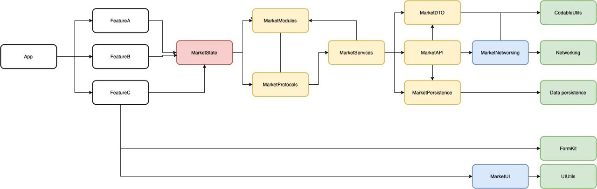

# Модульность (WIP)

## Как создать свой модуль

1. Заводим папочку `Market<ModuleName>` в папке `Modules`, внутри создаем папку `Sources`, `Resources` (если необходимо), `Tests` (если планируем писать тесты) и `Market<ModuleName>.podspec`.

2. Оформляем `podspec`. Можно взять любой в качестве примера и переделать на свой лад. Документация по синтаксису `podspec` [здесь](https://guides.cocoapods.org/syntax/podspec.html).



Если используешь в `spec.dependency` модуль, в котором есть objc (прим. `MarketUI`), то могут возникнуть совершенно непонятные ошибки сборки. Лечится добавлением:
```
s.xcconfig = {
    'HEADER_SEARCH_PATHS' => [
        '"${PODS_ROOT}/Headers/Public/MarketUI"'
    ]
  }
```



3. Кладем нужный код в папку `Sources` (для начала хватит и пустого `.swift` файла).

4. Подключаем к проекту. В `Podfile` достаточно вызывать функцию `local_pod` с именем модуля. 

5. `make gen`

6. Готово, вы восхитительны 🎉

## Схема модульности

