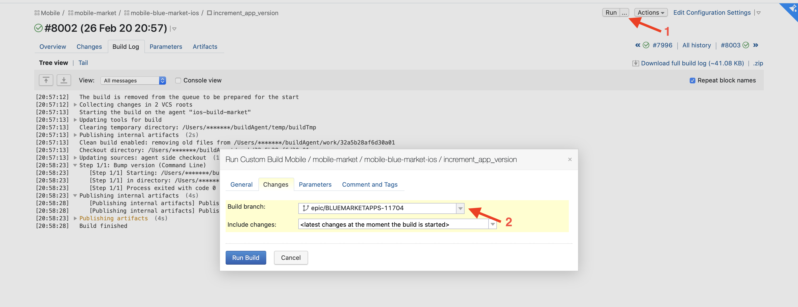
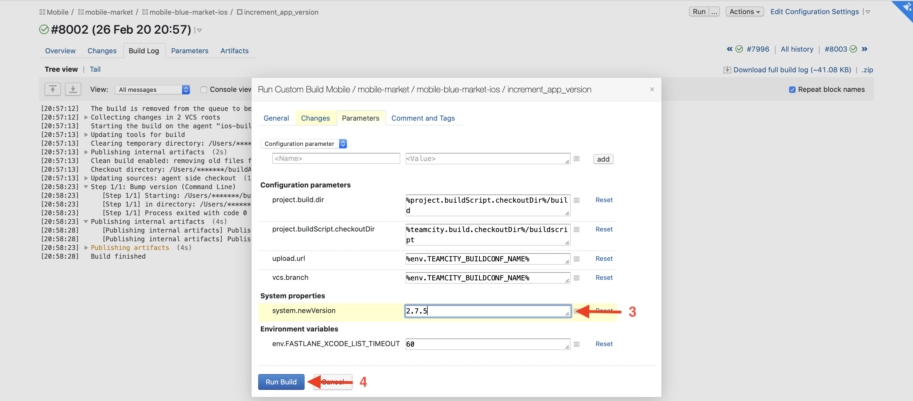
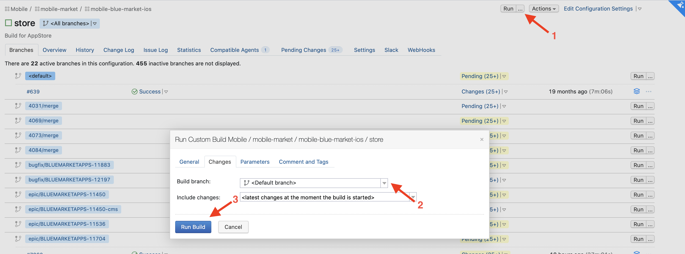
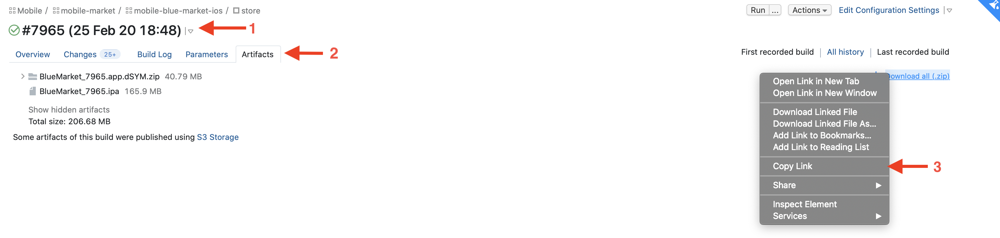
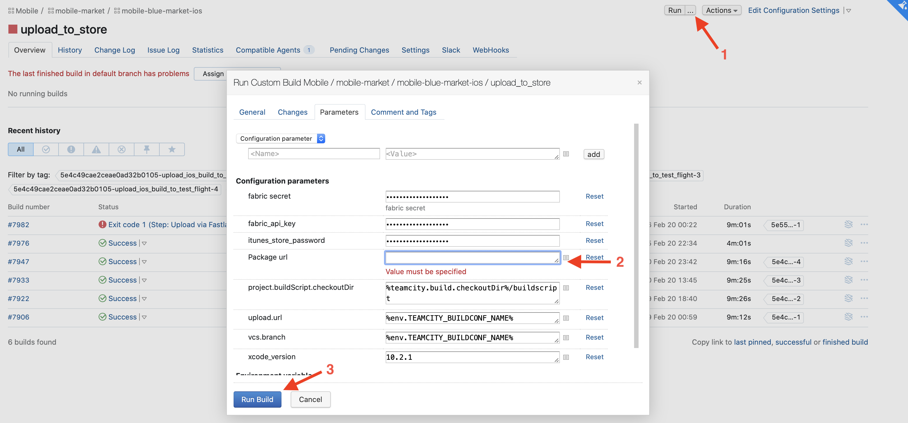

# Ручное тестрование

Если вам для тестирования задачи нужна сборка в TestFlight, то её можно залить следующим способом:



Шаг №1 достаточно выполнить один раз. Если вы повторно загружаете эпик в тестфлайт (например, после фиксов), можно сразу переходить ко второму шагу, так как версию уже подняли ранее



1. Запускаем [джобу для повышения версии](https://teamcity.yandex-team.ru/viewType.html?buildTypeId=MobileBlueMarketIos_IncrementAppVersion). Это нужно из-за того, что в AppStore допускаются только сборки с номером версии большим, чем в текущем релизе.
    1.1. Нажимаем кнопку рядом с `Run` 
    1.2. Выбираем ветку эпика
    1.3. Указываем номер версии. Номер должен быть на 1 больше, чем сейчас в сторе. То есть, если в сторе версия 2.7.4, здесь указываем 2.7.5
    1.4. Запускаем 
    
    
2. Запускаем [сторовскую сборку](https://teamcity.yandex-team.ru/viewType.html?buildTypeId=MobileBlueMarketIos_Store). Шаги аналогичны:
    2.1. Нажимаем кнопку рядом с `Run` 
    2.2. Выбираем ветку эпика
    2.3. Запускаем
    
3. После того, как сторовская сборка готова
    3.1. Переходим на страницу билда
    3.2. Выбираем вкладку `Artifacts` 
    3.3. Копируем ссылку `Download all` 
    
4. Запускаем джобу [загрузки в стор](https://teamcity.yandex-team.ru/viewType.html?buildTypeId=MobileBlueMarketIos_UploadToTestFlight)
    4.1. Нажимаем кнопку рядом с `Run` 
    4.2. В поле `Package url`  вставляем ссылку на архив, скопированную на предыдущем шаге
    4.3. Запускаем
    



После загрузки и обработки сборки она станет доступной в TestFlight. Этот процесс занимает около часа.


