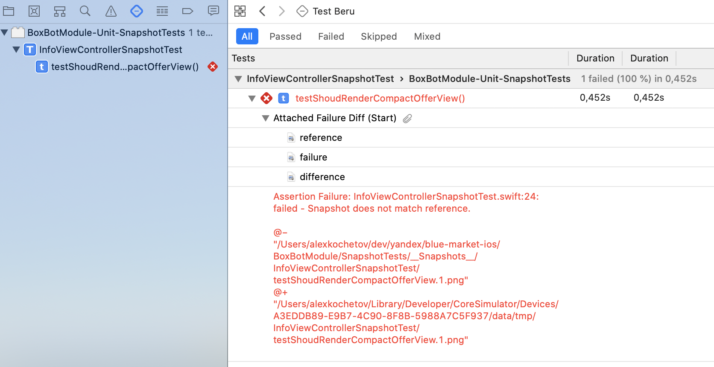
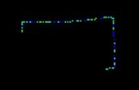
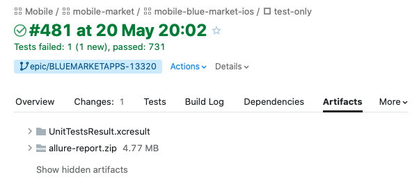

# Snapshot тестирование

## Что это?
Вид юнит-тестирования, позволяющий сравнивать текущий скриншот UI-элемента и эталонное изображение.

## Что тестируем?

На текущий момент объектом снепшот-тестирования являются все новые UI-элементы (кнопки, панели, поля, свитчи, etc.). Снепшот-тестирование подразумевает появление у каждого UI-элемента состояния, модели или конфигурации.

## Что используем?

В качестве основного фреймворка для снепшот-тестирования был выбрано решение от [Pointfreeco](https://github.com/pointfreeco/swift-snapshot-testing). Снепшот-тест это обычный юнит-тест.

## Как тестировать?

1. Создать новый юнит-тест, отнаследоваться от `XCTestCase` 
2. Импортировать в юнит-тест фреймворк SnapshotTesting 
3. Импортировать модуль, в котором находится тестируемый элемент, e.g. `@testable import BoxBotModule` 
4. Инициализировать тестируемый элемент (`UIViewController`, `UIView`, etc.) 
5. Написать необходимое количество тестов, каждый из которых апдейтит тестируемый элемент неким view-стейтом
6. В каждом тесте добавить функцию `assertSnapshot`  из экстеншена к `XCTestCase`  `SnapshotHelper.swift `
7. Запустить тест! После первого прогона тест упадет, и в папке где находится искомый тест появится рендер состояния тестируемого элемента, его можно найти в папке `${SRC_ROOT}/__Snapshots__/[XCTestCase name]/[unit-test-name].png`. Можно принудительно записать снэпшот, установив параметр `recording`  в true  у функции `assertSnapshot` .
8. Проверить созданный рендер на предмет адекватности и правильности отрисовки
9. Запустить тест еще раз и убедиться, что он проходит
10. Прогоняем все юнит-тесты в схеме Beru  `⌘ + U` `git commit -a -m "я сделалъ свой первый снепшот-тест"`

## Как решать проблемы?

В случае, если снепшот-тест фейлится, идем в Report Navigator  и там можем посмотреть эталонное изображение, рендер и дифф-изображение, где рендер наложен на эталон и подкрашены различающиеся пиксели: 



Если снепшот-тест фейлится штатно (так как изменился сам компонент), то необходимо перезаписать эталонное изображение. Это можно сделать удалив рендер и прогнав тест или путем выставления флага recording  в true  у функции `assertSnapshot`.



В случае, если мы изменяем имя `XCTestCase`  или тестовой функции, фреймворк генерирует новые изображения, старые рендеры так и останутся в папке с тестом, на текущий момент обязанность по проверке, не лежат ли в папке неиспользуемые рендеры, ложится на разработчиков.





Снепшоты должны сверяться и создаваться на симуляторе с одной и той же OS, на одном и том же устройстве, учитывая скейл и цветовую палитру. На текущий момент это `iPhone 8, iOS 14.5`.



Если снепшот-тест валится, и в диффе только черный экран, необходимо выкачать рендер и эталон и сравнить их размеры - если отличаются (если нет - это странно и нужно детально разбираться), выкачиваем дифф и открываем его в `Preview` , жмём `Tools  --> Adjust colors`  и выкручиваем в ноль экспозицию. На диффе неизбежно подсветятся различающиеся пиксели. 

 



Была выявлена проблема в `Xcode / iOS SDK`  - при добавлении новой картинки в ассет одна из картинок, добавленных ранее меняла свое начертание 🤷‍♂️ Пока кейс единичный - просто перезаписываем эталоны.



## А что с CI?

В артефактах тимсити после прогона тестов можно найти `UnitTestsResult.xcresult`, скачиваем, открываем его в Xcode и видим уже знакомый репорт прогона юнит-тестов, с дифами зафейленных тестов.



## Hints

Есть возможность рендерить скролл-вью в единое изображение, как указано здесь: 
```swift
assertSnapshot(matching: vc, as: .image(on: .init(safeArea: .zero, size: .init(width: 480, height: 2000), traits: .init()))) 
```
Если необходимо протестировать снепшотами стейт экрана, который перерисовывается асинхронно, есть возможность применить wait стратегию:
```swift
assertSnapshot(matching: sut, as: .wait(for: 1, on: .image(on: .iPhone8))) 
```
