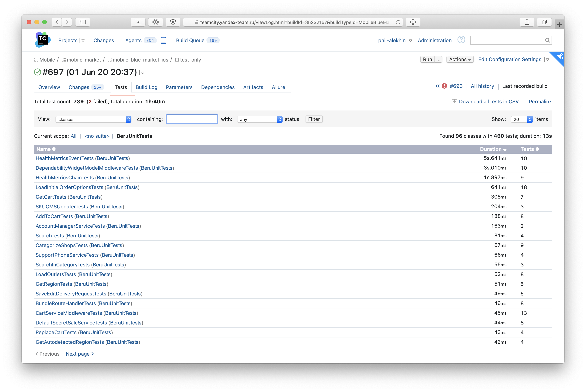

# Unit-Тесты

## Рекомендации по написанию тестируемого кода

1. При написании кода следует руководствоваться [принципами SOLID](https://ru.wikipedia.org/wiki/SOLID_объектно-ориентированное_программирование), особое внимание стоит обратить на [Single responsibility principle](https://ru.wikipedia.org/wiki/Принцип_единственной_ответственности) и [Dependency inversion](https://ru.wikipedia.org/wiki/Принцип_инверсии_зависимостей).
2. Лучший тест - тест, который не написали. Если есть возможность гарантировать работу кода с помощью компилятора, стоит поступить именно так.

## Хорошие практики и советы

### Маленькие тесты
Тест должен быть коротким и легкочитаемым. Должно быть понятно какой результат хотим получит и при каких условиях. Хорошое правило: один тест - один ассерт.

### Поддерживаемость
Важно относится к тестам также, как к основному коду. Давать хорошие имена классам, методам и переменным, соблюдать принятый style guide, вовремя чинить и рефакторить.

### Независимые тесты
Тесты никак не должны зависеть друг от друга. Старайтесь избегать использования общих переменных, объектов между тестами. Такие тесты могут флакать на CI, что сильно мешает жить.

### Анализ сode coverage
При написании тестов, с помощью Xcode можно анализировать покрытие кода. Желательно добиваться 100% покрытия.

### Тестирование чужого кода
Не стоит писать тесты, проверяющие работу чужого кода. Зависимости обновляются, а вместе с ними и реализация внутренних механизмов. Это приводит к падениям тестов и замедляют нашу работу.

### Dependency injection
Все зависимости трестируемого кода стоит проставлять явно, без использования DI фреймфорка, в setUp методе. А вместо настоящих, используемых в коде зависимостей подставлять моки.


### Примеры 

_**Плохо**_

```swift
override func setUp() {
  super.setUp()

  let serviceAssembly = AssemblyActivator.shared.resolve() as ServiceLayerAssembly
  service = serviceAssembly.resolve() as SomeService
}
```

_**Лучше**_
```swift
override func setUp() {
  super.setUp()
  service = SomeService(apiClient: APIClient())
}
```

_**Хорошо**_
```swift
override func setUp() {
  super.setUp()
  // Вместо настоящей зависимости подставляем мок.
  mockApiClient = MockAPIClient()
  service = SomeService(apiClient: mockApiClient)
}
```

### tearDown методы важны
Всегда удаляйте использованные объекты в `tearDown`. 
Подробнее [здесь](https://qualitycoding.org/xctestcase-teardown/).

### XCTAssert 
`XCTest` предоставляет несколько видов assert'ов. Для каждого случая стоит использовать наиболее подходящий по смыслу.

#### Пример
```swift
func test_example() {
  // плохо
  XCTAssert(array.isEmpty == true)
  
  // хорошо
  XCTAssertTrue(array.isEmpty)

  // плохо
  guard let _ = result else { 
    XCTFail("result is nil")
  }

  // Хорошо
  XCTAssertNotNil(result)

  // и т.д.  
}
```

### Error handling
С Xcode 11.4 появилась возможность писать throwing test methods. Если тестируемый код может выбросить ошибку, то тест значительно можно упростить.

```swift
// Раньше приходилось писать как-то так
func test_example() {
  do {
    let data = try Data(contentsOf: ...)
  } catch {
    XCTFail("Something goes wrong")
  }
}

// Теперь можно вот так
func test_example() throws {
  let data = try Data(contentsOf: ...)
}
```

Точно такой же подход можно использовать в новых методах: `setUpWithError` и `tearDownWithError`. Что в некоторых случаях упрощяет настройку теста.

```swift
override func setUpWithError() throws {}
override func tearDownWithError() throws {}
```

### Optional values
Новую функцию `XCTUnwrap` и улучшения описаные выше можно скомбинировать и получить более удобный способ обработки optional values.

```swift
// Можно написать как-то так 
func test_example() {
  guard let value = someValue else {
    XCTFail("someValue is nil")
  }
  ...
}

// А можно вот так
func test_example() throws {
  let value = try XCTUnwrap(someValue)
  ...
}
```

## Оформление тестов

1. Для каждого теста создается отдельный `<ИмяТестируемогоКласса>Tests.swift` файл, который добавляется в тестовый таргет приложения (`BeruUnitTests`) или модуля (`LangExtensions`, `UIUtils` и т.д).
2. Следует придерживаться следующей структуры:

```swift
import XCTest
@testable import SomeTestableCode

class SomeTest: XCTestCase {

  // Properties
 
  var someService: SomeService!

  // setUp, tearDown методы

  override func setUpWithError() throws { ... }
  override func tearDownWithError() throws { ... }
  
  // Тесты
  func test_foobar() throws {}

  // Вспомогательные методы

  private func makeUserData() -> UserData { ... } 
}

// Nested types
private extension SomeTest {
  enum Constants {}

  class APIMock: API {}
}
```

3. Важно давать понятные названия тестам. По соглашениям принятым ранее, naming методов примерно следующий:
```swift
// test - обязательный префикс, нужный XCTest
// shouldReturnNil - ожидаемое поведение
// whenResponseIsEmpty - условия в которых тестируется код
func test_shouldReturnNil_whenResponseIsEmpty() { ... }
```

4. Тело теста разбивается на три части: **given**, **when**, **then**.
```swift
func test_shouldReturnNil_whenResponseIsEmpty() {
  // given
  // подготовка входных данных/окружения
  
  // when
  // вызов тестируемого кода

  // then
  // проверка полученных результатов с ожидаемыми
}
```
## Запуск тестов
В проекте есть несколько способов запустить unit тесты.
1. Самый простой. В Xcode выбрать схему `Beru` и нажать комбинацию клавиш `Cmd + U`.
2. С помощью утилиты `make`.
```bash
cd /project_folder
make build_for_testing
make test_without_building
```

### Unit тесты на Teamcity
При запуске epic-пайплайна в ЦУМе происходит полный прогон всех видов тестов (`unit`, `snapshot`, `ui`). `Test runner` устроен таким образом, что unit и snapshot тесты прогоняются всегда первыми, при наличии упавших тестов, прогон прекращается.

Посмотреть список прошедших и упавших тестов можно, перейдя на вкладку `Tests`.



[Оригинал](https://wiki.yandex-team.ru/users/phil-alekhin/beru-ios-unit-tests/)
