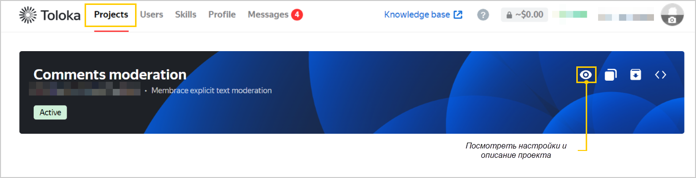

# FAQ





- In the web interface

  In your account, go to**Profile** → **Expenses** and select the date and project you want to check.

- Via the API

  To get the cost `cost`, multiply the item price `item_price` by the number of labeled elements `item_count`.







Request [project information](https://toloka.ai/docs/toloka-apps/api/ref/app-project/app-projects_app_project_id_get.html) via the API. The `item_price` attribute is the price for labeling one element.





Select the project in your account and click the  icon. A window will open with the project's settings and description.





Only a limited number of elements can be sent at the same time: `/app-projects/{app_project_id}/items?sort=finished&after_id={last_saved_item_id}` returns no more than 100 items at a time. If the field value is `"has_more" = true`, there are more results. In this case, update `after_id` and repeat the query to get more results.



