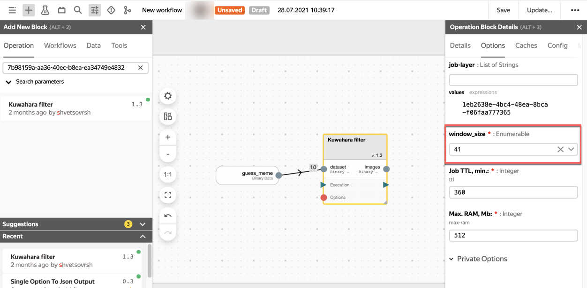
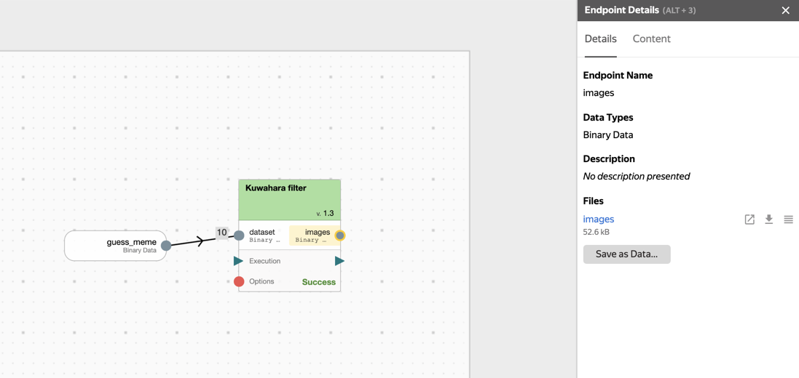

# Урок 6. Преобразование данных с помощью операций



## Шаг.1 Создадим воркфлоу и добавим в него граф {#step-1}

1. Откроем в <https://nirvana.yandex-team.ru/> персональный каталог или нажмем на иконку дома в меню слева.
2. Нажмем кнопку **Create...** -> **Workflow**. Откроется редактор графа.

## Шаг 2. Добавим блок данных {#step-2}

1. Откроем палитру поиска объектов. На верхней панели слева нажмем значок плюса и выберем вкладку **Data**.
2. Найдем данные [guess_meme @shvetsovrsh](https://nirvana.yandex-team.ru/data/de8f5835-0473-4460-b8e7-0f69f0934ef9). Данные лучше искать по id — `de8f5835-0473-4460-b8e7-0f69f0934ef9`.
3. Перетащим данные в редактор графа.

## Шаг 3. Добавим операцию {#step-3}

1. Вернемся к палитре поиска объектов и откроем вкладку **Operation**.
2. Найдем операцию [Kuwahara filter](https://nirvana.yandex-team.ru/operation/7b98159a-aa36-40ec-b8ea-ea34749e4832). Операцию лучше искать по id — `7b98159a-aa36-40ec-b8ea-ea34749e4832`.
3. Перетащим данные в редактор графа.
4. Нажмем на блок операции на графе.
5. Укажем в **Operation block details** -> **Оptions** -> **window_size** значение `41`.

   

## Шаг 4. Установим связи и запустим граф {#step-4}

1. Соединим точку выхода блока данных с точкой входа блока операции как на видео:

2. Сохраним граф:2.1 Нажмем кнопку **Save** на верхней панели и добавим название воркфлоу.2.2 Нажмем **Apply**.
3. Запустим граф. Нажмем кнопку **Run...** на верхней панели.
4. В открывшемся окне подтвердим запуск c квотой по умолчанию **Run with selected quota**.
Если результат выполнения успешен, скачаем полученный архив с выхода операции, добавим к нему расширение `.tar`. Распакуем и попробуем угадать мем :)

## Шаг 5. Сохраним данные из результата выполнения операции

1. Нажмем кнопку **Save as data** (см. скриншот выше).
2. Заполним форму, аналогичную форме создания файла на странице **Data**.
3. В TTL укажем 1 день, чтобы данные не хранились долго в Нирване.
