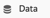
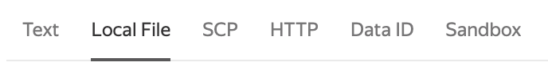
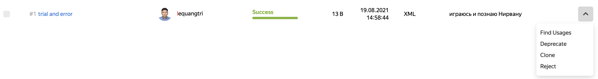
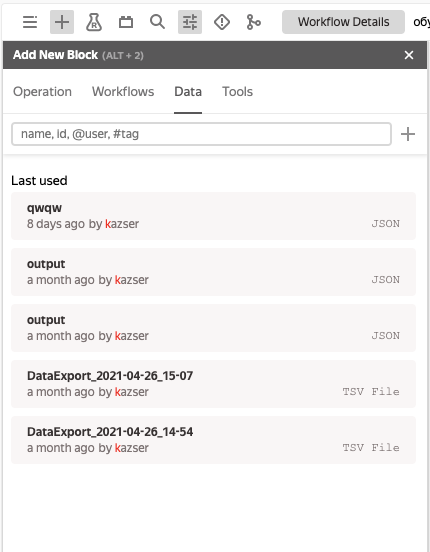

# Урок 3. Данные



1. [Рассмотрим данные и создадим объект данных](#step-1)
1. [Добавим данные на граф](#step-2)

## Шаг 1. Рассмотрим данные и создадим объект данных {#step-1}

В Нирване можно использовать данные не только из выходов операций, но и отдельные данные из разных источников. Для загрузки, хранения и управления такими данными существует раздел [Data](https://nirvana.yandex-team.ru/data). Раздел также можно открыть по кнопке  в левом меню.

На главной странице раздела показаны последние загруженные тобой в Нирвану данные. Скорее всего, у тебя не будет загруженных данных, поэтому создадим первый объект:

1. Нажмем кнопку  **Create Data**.

   

1. Создадим объект данных:

   2.1 В правой части страницы выберем популярный источник загрузки данных в Нирване:

      

   - Text — вставка контента в браузерный текстовый редактор.
   - Local File — загрузка файла с компьютера.
   - С другими источниками предлагаем тебе разобраться самостоятельно!
   Используем вкладку Text и загрузим текст письма из урока «Запускаем граф».

   

   ```
   Hello, ${global.nickname}!

   Looks like you just have runned your first Nirvana graph. Well done!
   Do not stop because there are still many interesting things to come.

   Here you can find some usefull links about Nirvana:
   If you have any questions - nirvana@yandex-team.ru
   Fresh news and hot debates – https://clubs.at.yandex-team.ru/nirvana/
   Issues reports and feature requests are always welcome – https://st.yandex-team.ru/NIRVANA/new

   With all our love, Nirvana Team.
   ```

   

   Только нужно заменить плейсхолдер ${global.nickname} на никнейм заранее — на данные в файле не распространяются глобальные опции графа.

   2.2 В левой части страницы укажем:
      * Name — имя, должно быть уникальным.
      * Type — тип данных, под которым файл будет видеть Нирвана. Важно выбрать корректный тип данных — входы операций принимают только определенные типы.
      * Quota — в какой квоте будет храниться файл. Оставляем квоту по умолчанию.
      * TTL — время хранения данных.
      * Tags — можно добавить теги для удобной группировки загруженных файлов.
      * Description — краткое описание, какие данные загружены и для чего их использовать.
      * Permissions — выбор ролей, члены которых смогут прочитать данные (осторожно, по умолчанию открыто на всех).

1. Нажимаем кнопку **Create**, чтобы загрузить и сохранить объект.

   

   Теперь в разделе **Data** появился первый файл.

   

   > При большом количестве файлов можно воспользоваться поиском вверху страницы — по имени, дате создания и другим параметрам файла. В созданном файле нельзя отредактировать параметры, но можно клонировать его и поменять нужные поля при клонировании.
1. Справа от описания файла нажмем на стрелочку и рассмотрим действия, которые можно совершить с файлом после его создания:

    

   - Find Usages — показывает список графов, в которых используется файл.
   - Deprecate — отмечает файл как списанный.
   - Clone — клонирует файл.
   - Reject — удаляет файл.

## Шаг 2. Добавим данные на граф {#step-2}

Для начала клонируем [граф из первого урока](https://nirvana.yandex-team.ru/flow/13689131-d174-4c8f-bdd7-7b3032e2b4b1/538a726f-992d-4049-96e5-168253c6c2c2/graph) себе в домашний каталог и откроем его.

Чтобы на граф добавить файл, созданный на шаге 1, найдем этот файл в палитре добавления новых блоков:
1. Выбираем вкладку **Data**. По умолчанию отобразятся последние использованные файлы, но есть гибкий поиск как на странице Data.

   

2. Зажмем выбранный объект мышкой и перетащим его в редактор графа.

   

   Ваш загруженный файл превратился в блок данных в редакторе графа.

Осталось только удалить старую операцию с текстом и восстановить её связи с другими кубиками, но уже с новым блоком данных, и запустить граф.
