# Урок 21. Что такое хороший продакшн процесс?



В этом разделе я расскажу, как команда Нирваны настраивает свои процессы и рекомендует настраивать ваши. Если будете следовать этим советам, ваши процессы будет проще обслуживать и поддерживать в рабочем состоянии. Вы можете отклоняться от рекомендаций, если хорошо понимаете, что делаете :)

## Используйте проектный каталог

Рабочие процессы (воркфлоу) лучше всего складывать в проектный каталог в дереве навигации — вашим коллегам будет просто его найти, а вам будет удобно управлять доступом.

Перед началом работы спросите коллег, какой проектный каталог они используют. Если каталога пока нет — закажите новый каталог, нажав кнопку **+** и выбрав пункт **Каталог**. Появится форма-опросник, после её заполнения будет создан тикет в саппортную очередь Нирваны. В течение пары часов дежурный Нирваны создаст вам каталог и поможет его настроить.

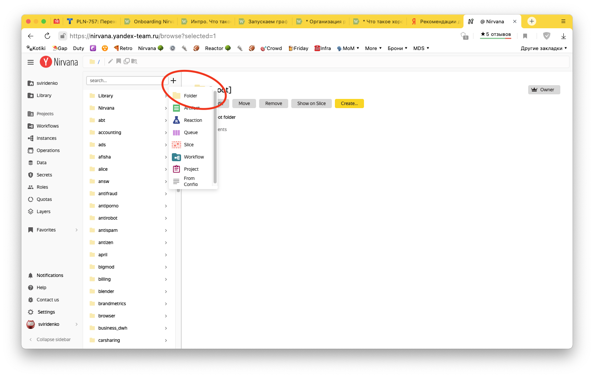

Воркфлоу, которые точно не понадобятся вашим коллегам (что-то мелкое, временное, тестовое), удобно держать в своем домашнем каталоге `/home/username`.

Внутри проектного каталога создавайте любую удобную вам структуру из подкаталогов. Как настроить права доступа, расскажу ниже.

## Настройте доступы

Заведите роль для своей команды. Добавьте в неё людей либо по ABC-сервису / роли, либо по Staff-ветке. Так вам не придется самим добавлять / удалять людей из роли — достаточно будет после выхода человека добавить его в ABC-сервис.

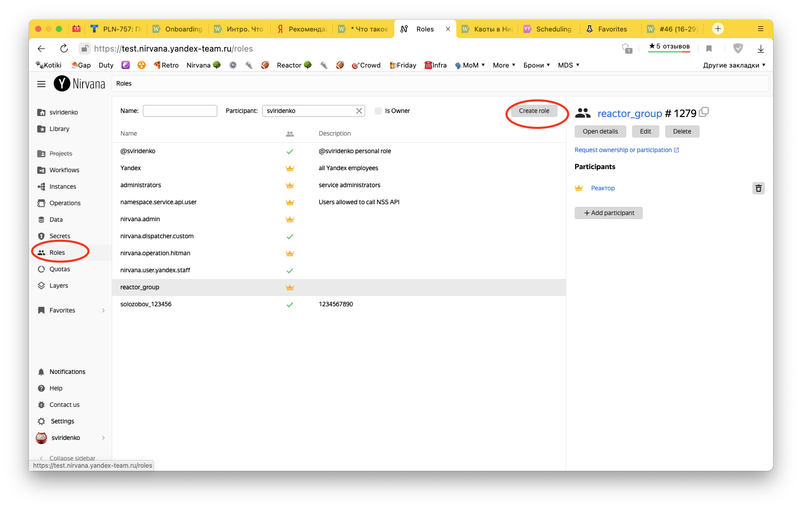

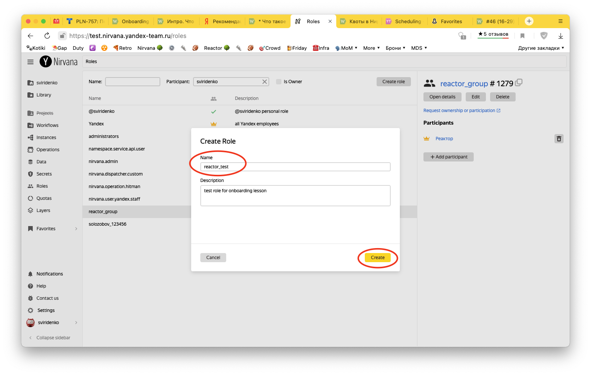

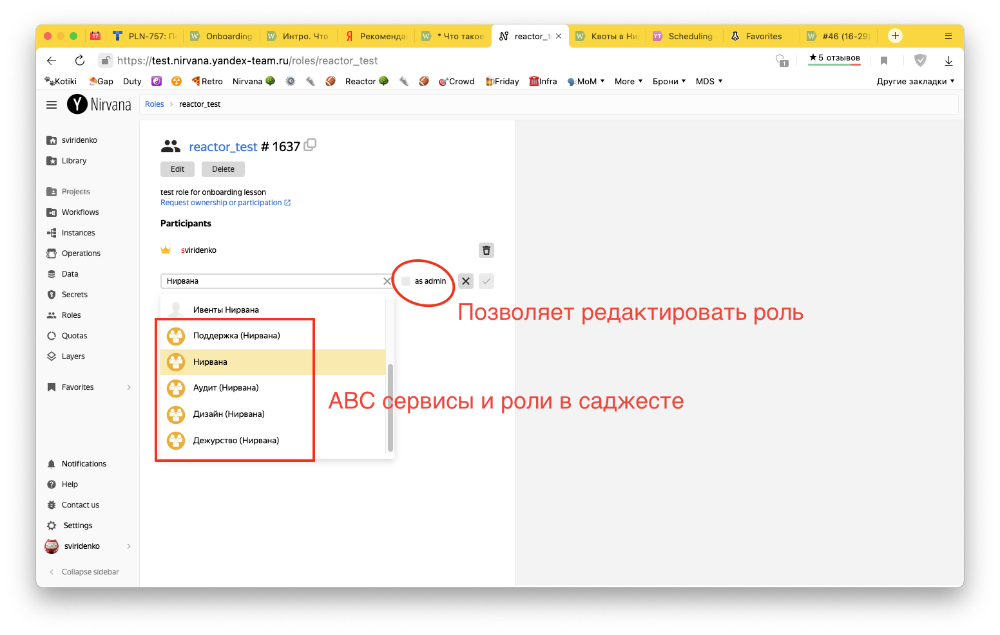

Выдайте **Write**- или **Owner**- доступы для команды к вашему каталогу. **Write** позволяет создавать и редактировать сущности, **Owner** дополнительно позволяет редактировать права доступа.

Нирвана позволяет наследовать права доступа во вложенные каталоги и сущности. Для этого в диалоге **Permissions** нажмите кнопку **Propagate** слева от имени роли:

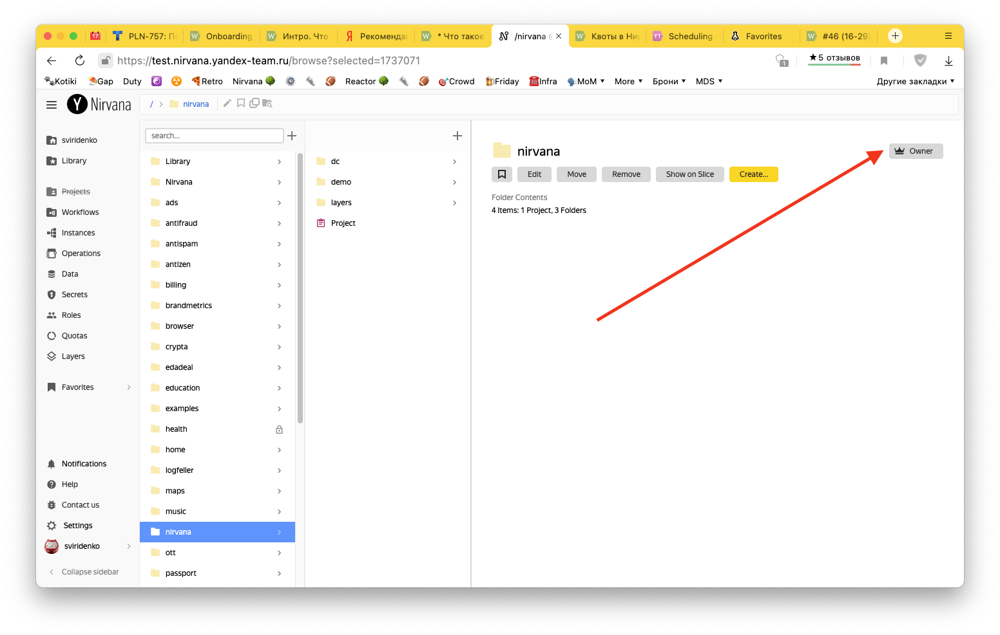

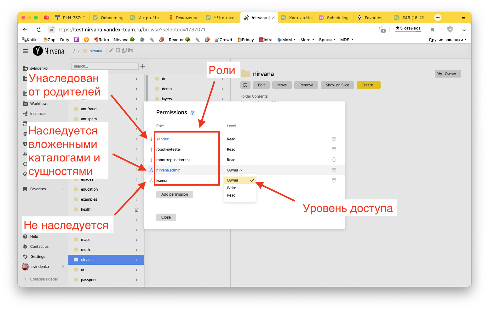

## 3. Запускайте процесс от имени робота

Если процесс запускается от имени сотрудника, то при ротации или увольнении этот процесс гарантированно сломается (оторвутся доступы, инвалидируются токены, и т.п.). Чтобы избежать этих проблем, процессы в production нужно запускать от имени робота.
1. узнайте у коллег, какие роботы используются в вашем сервисе, и для чего нужен каждый из них; при необходимости закажите [нового робота](https://wiki.yandex-team.ru/diy/zombik/)
2. добавьте роботу доступ `Executor` в вашей квоте, чтобы он мог запускать в ней графы
3. запросите для робота роли в Нирване: `Yandex` и `nirvana.user.yandex.staff`, перейдя в IDM по ссылке с карточки роли (чтобы он имел доступ к операциями и данным)
4. если используете Реактор — добавьте робота в свой ABC-сервис, а людям выдайте роли **Управляющий роботами** либо **Пользователь роботов** в том же ABC-сервисе (Реактор проверяет эти условия и не даст другим людям запустить процесс от имени вашего робота, подробнее читайте )
## 4. Переключайте графы осознанно

Метка Main (иконка "короны" в списке графов) указывает на "главный" граф внутри воркфлоу.

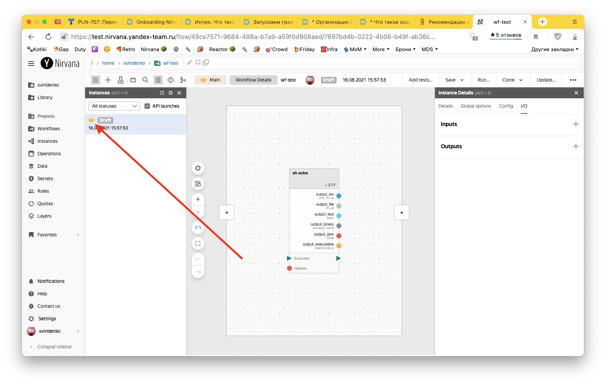

Регулярные запуски Реактором и формы Domain Constructor, настроенные на ваш воркфлоу, будут копировать именно этот граф.

Мы рекомендуем использовать режим **Manually** (т.е. ручное переключение Main-графа).

Как переключить режим:
- открыть редактор графа
- нажмите кнопку **Workflow details**
- нажмите **Edit**
- переключите настройку с **Auto** на **Manually**
- нажмите **Save**

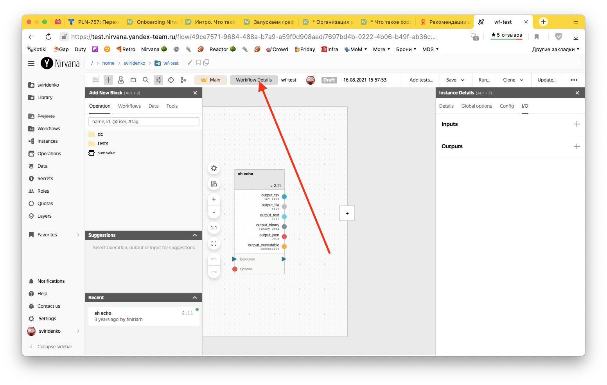

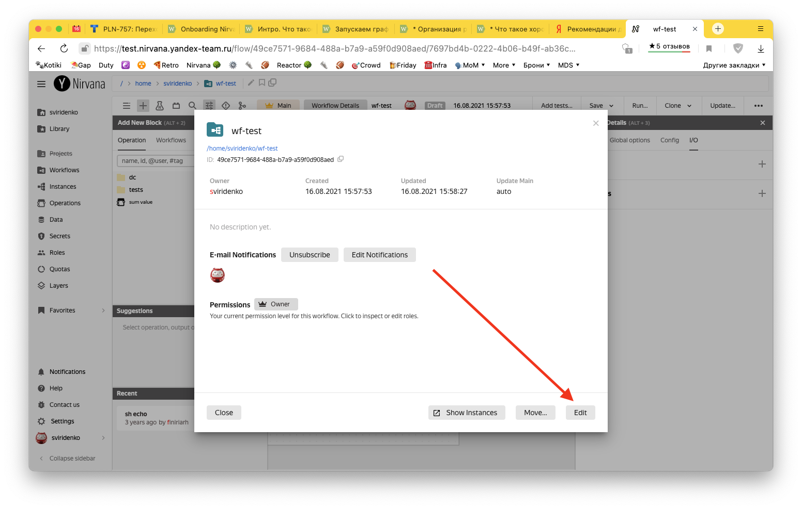

Для переключения метки на новый граф внутри воркфлоу используйте кнопку **Set as main**:

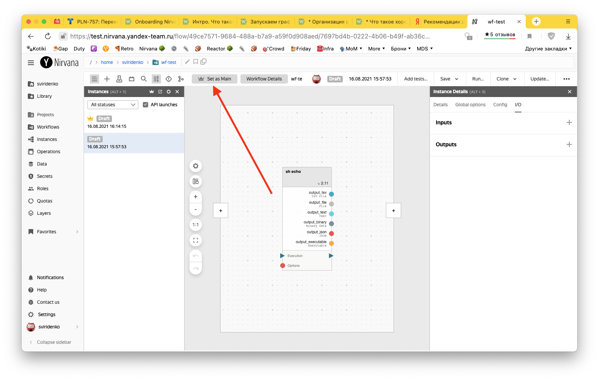

## 5. Запускайтесь в собственной квоте

Квота определяет доступные для запуска ресурсы.

По умолчанию вам будет доступна только общая квота-песочница **No guarantee (default)**. Она подходит, чтобы попробовать запускать графы в Нирване, но категорически не подходит для запуска любых production-процессов. В ней вы "толкаетесь" в общей очереди с другими пользователями и ваш запуск никто не гарантирует.

Для production-процессов обязательно закажите собственную [вычислительную квоту](https://nirvana.yandex-team.ru/quotas) — даже без твёрдой гарантии на вычислительные ресурсы (CPU и GPU) ваши запуски в ней будут намного надежней, чем в "No guarantee (default)".

Квота для запуска графа настраивается на вкладке **Config**:

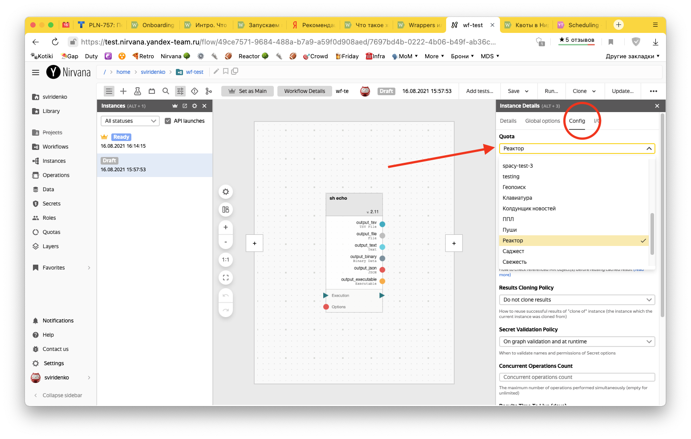

При создании реакции в Реакторе или формы в Domain Constructor квоту для запуска графа можно переопределить, не изменяя настроек базового графа:

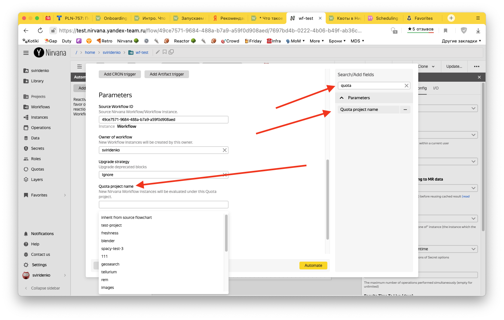

## 6. Защитите базовый граф от случайных изменений

На время отладки можно использовать графы в статусе **Draft**. Когда вы убедились, что граф работает как нужно, лучше предотвратить внесение в него случайных изменений и перевести в статус **Ready** при помощи кнопки **Approve**. Статус графа отображается в списке и в шапке:

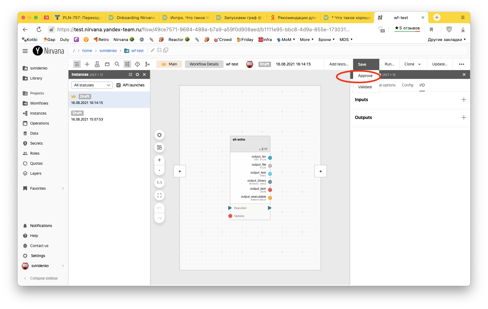

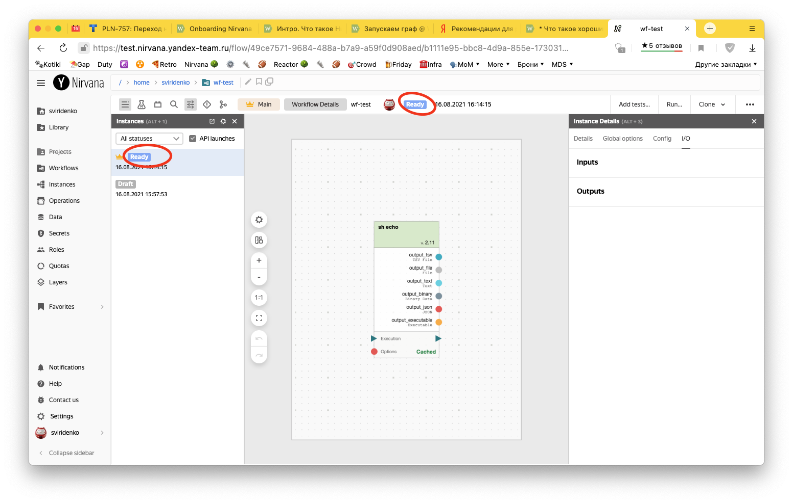

## 7. Регулярные запуски (реакции)

Используйте  для регулярных и событийных запусков графов. Переключаться между Нирваной и Реактором можно через иконку "бутерброд" в левом верхнем углу:

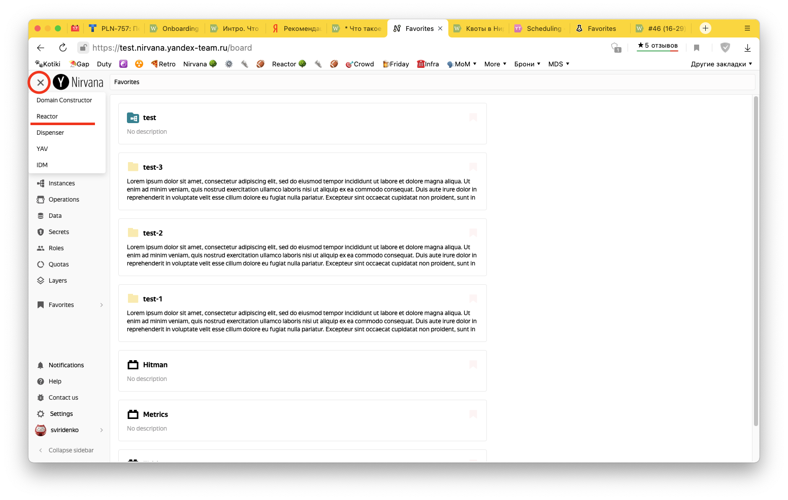

- Артефакты и реакции храните в каталоге или подкаталоге сервиса в дереве навигации.
- Для квотирования Реактор использует Project-файлы; если у вас в каталоге нет Project-файла, напишите в рассылку

   или в "жука", чтобы дежурный Реактора создал его для вас
- Воркфлоу с шаблонными инстансами лучше отделить от воркфлоу для запусков (настройка реакции Target workflow). Также вы можете пользоваться фильтром **API launches** в списке инстансов, переключаясь между всеми запусками и только ручными запусками.
- Выберите и установите разумный `Instance TTL` (срок жизни инстанса в днях). 30 дней — хорошее значение по умолчанию для запусков 1 раз в день. Для **более частых** запусков (раз в час, раз в 10 минут) возьмите значение **меньше**, для менее частых (раз в неделю, раз в месяц) можете взять значение больше.

## 8. Хочу использовать Нирвану / Реактор на полную катушку!

[В нашей документации](https://docs.yandex-team.ru/nirvana/production) больше советов и деталей для тонкой настройки — читайте и пользуйтесь.
