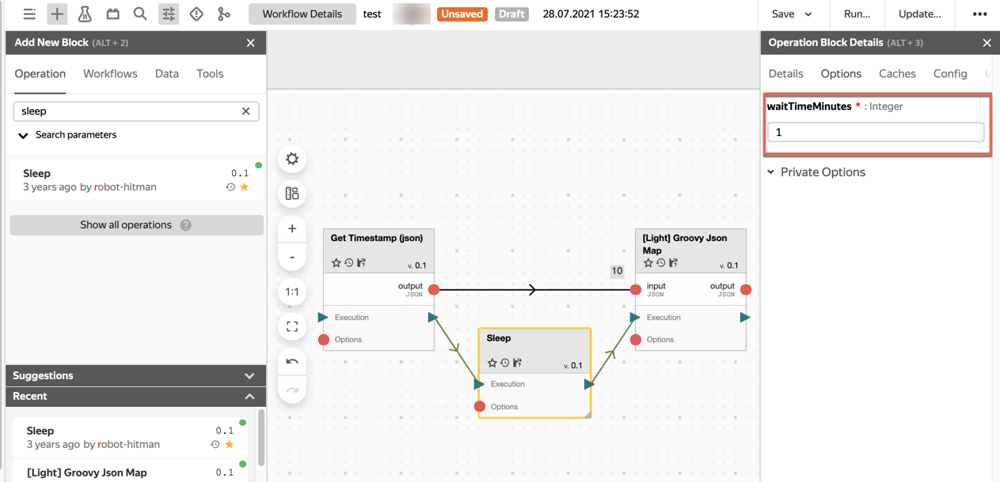

# Урок 5. Управление логикой выполнения графа



## Шаг 1. Добавим операцию и связи по управлению в новый экземпляр графа

Нирвана не была бы таким гибким инструментом, если бы не давала нам управлять порядком выполнения операций с помощью входов/выходов блоков, предназначенных для связей управления.Связи по управлению обозначаются значком .

1. Создадим новую копию уже имеющегося графа. Для этого нажмем **Clone** в правом верхнем углу редактора графа.
1. Добавим операцию **sleep** (от robot-hitman и со звездой :star:) в редактор графа.
1. Нажмем на блок **sleep** и перейдем к панели **Operation block details**.3.1 Откроем вкладку **Options** и добавим в опцию **waitTimeMinutes** значение `1`.
1. Соединим новый блок с предыдущими с помощью связей по управлению.

   

1. Нажмем кнопку **Run** на верхней панели, чтобы запустить граф. Граф выполнится примерно через минуту. И в этот раз блок **Light Groovy Json Map** ждал, когда ему разрешит выполнение блок **sleep**.

# Шаг 2.  Добавим операцию и связи по данным в новый экземпляр графа

1. Клонируем граф из шага 1 с помощью кнопки **Clone** на верхней панели редактора графа.
1. Удалим блок **sleep** из редактора графа.
1. Найдем операцию **Light Json If** добавим ее в редактор графа.    3.1 Нажмем на блок операции и в параметре операции **filter** укажем значение `false`:

   

1. Добавим связи по данным и запустим граф с помощью кнопки **Run**.
Последняя операция была отменена, потому что не получила никаких данных на свой вход благодаря условию false в блоке **Light Json If**.

   

# Шаг 3. Добавим операцию и связи по динамическим опциям в новый экземпляр графа

Теперь переопределим параметры блока **Light
 Json If** c помощью связи по динамическим опциям. Значения опций, которые переданы через эту связь, имеют более высокий приоритет, чем заданные в самой операции.
1. Клонируем граф, полученный на шаге 3.
2. Добавим новую операцию **Single Option To Json Output**2.1 Укажем в опции **input** значение `{ "filter" : "true" }`
3. Установим связи по динамическим опциям с блоком **Light
    Json If**.
4. Запустим граф с помощью кнопки **Run**.

    Теперь все блоки графа выполнились. А в нашем блоке **Light Json If** теперь указан опция **filter** перезаписан и указано значение `true`.

    
