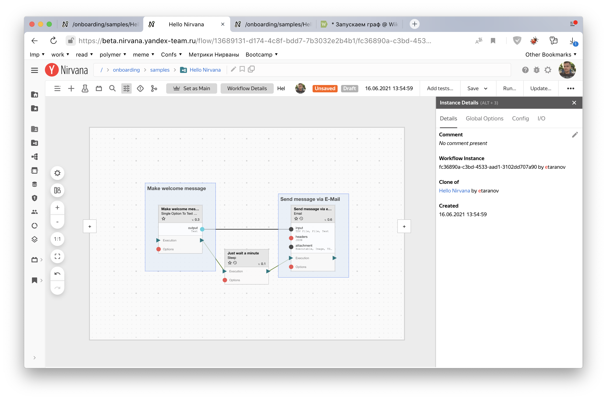
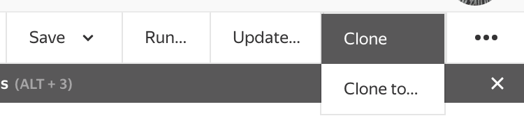
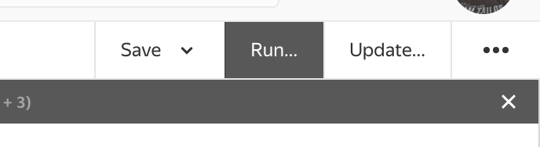
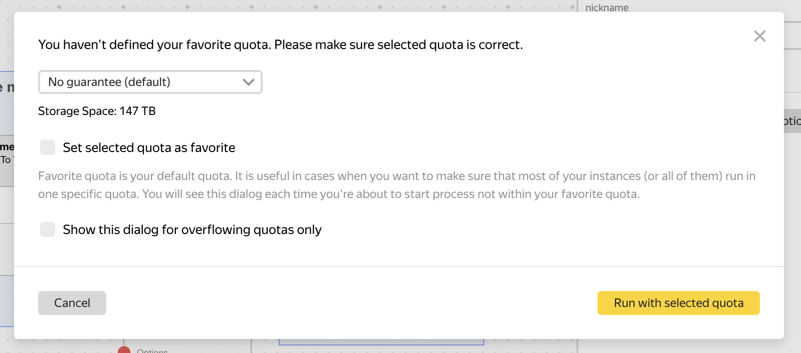
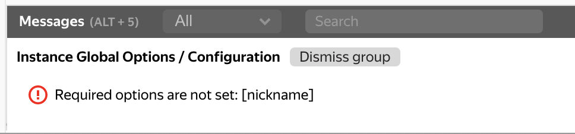
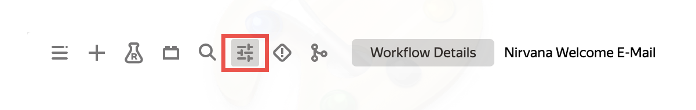
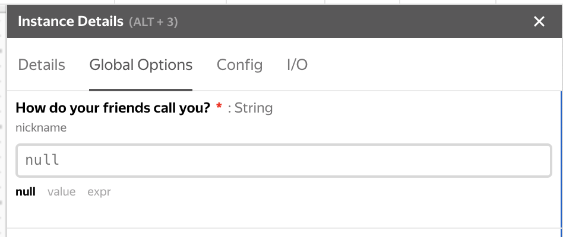
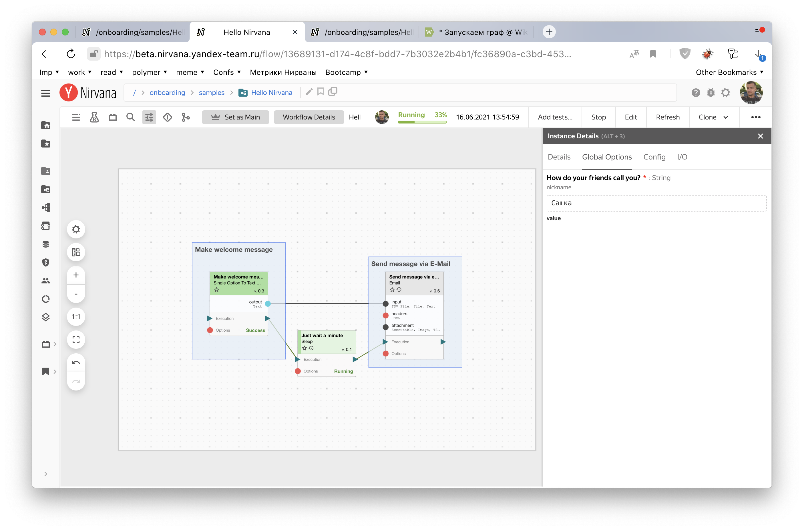
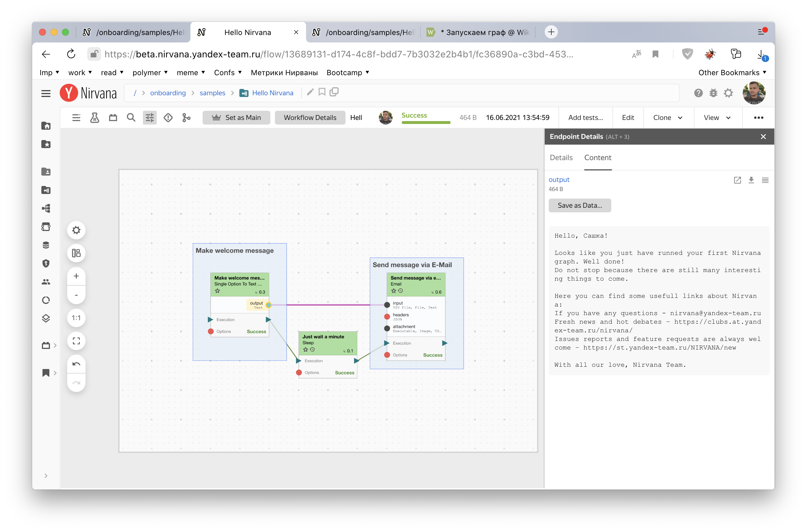

# Урок 1. Запускаем граф



## Шаг 1. Запустим первый граф {#step-1}

Процесс в Нирване описан в виде графа, который состоит из блоков операций, данных и связей между ними. Сейчас мы запустим готовый граф, который был создан одним из авторов этого курса.
1. Откроем [пространство](https://beta.nirvana.yandex-team.ru/flow/13689131-d174-4c8f-bdd7-7b3032e2b4b1), где «живет» наш граф. Оно называется **Редактор графа**.

   

1. Чтобы запустить граф, нужно создать его копию:2.1 На верхней панели справа нажимаем кнопку **Clone**.

   

   2.2 В открывшемся окне на верхней панели справа нажимаем кнопку **Run...**

   

   2.3 В диалоге выбора квоты ничего не меняем и нажимаем **Run with selected quota**.

   

   2.4 Кажется, что-то пошло не так.

   

   Попробуем отладить наш граф в следующем шаге.

## Шаг 2. Научимся отлаживать и перезапускать граф {#step-2}

Похоже на предыдущем шаге мы забыли указать значение для обязательной опции графа.Проверим, так ли это:
1. В верхней панели (её еще называют Selection panel) откроем вкладку `Global Options`. Так и есть — одна обязательная глобальная опция графа без значения.

   

   Обязательная опция отмечается красной звездочкой. Глобальные опции позволяют параметризовать множество процессов с помощью одного графа. Так нам не нужно будет делать для каждого имени отдельный процесс.

   

2. Заполним опцию неформальным прозвищем, которым обычно называют тебя друзья и/или родные. Например, «Сашка».
3. Нажмем значок с тремя точками -> **Run...** Теперь на какое-то время можно расслабиться и наслаждаться тем, как роботы работают за нас. :)
   Индикатор и статус выполнения графа можно посмотреть на верхней панели.

   Во время выполнения блоки будут закрашиваться зеленым цветом. Это значит, что процесс проходит без проблем. Примерно через минуту наш граф завершится успехом.

   

   Мы запустили первый граф в Нирване!

## Шаг 3. Получим результат после запуска графа {#step-3}

После выполнения графа проверь рабочую почту, там тебя ждет письмо с полезными ссылками о Нирване.

Хотя мы можем обойтись и без почты. Для этого нажмем на единственный выход (бирюзовый кружочек) блока **Make welcome message** и переключимся в правой панели на вкладку **Content**.

Тут мы видим текст письма, который пришел на почту. Когда блок заканчивает выполнение, если у него есть какие-то выходы, то результаты его работы можно найти на этой вкладке.

На этом всё, погнали дальше!
