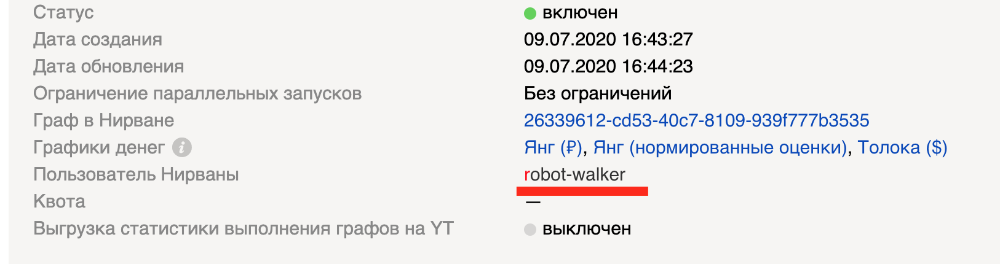
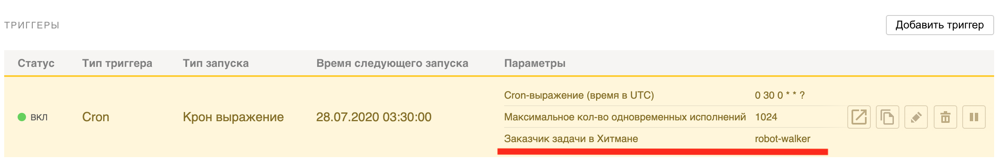
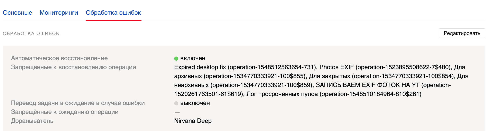
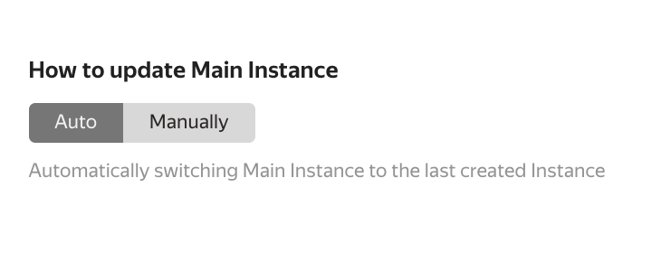

# Урок 27. Тестирование и ревью графов



**Подпишитесь на обновление этой страницы, она будет постоянно обновляться и дополняться новой полезной информацией**

> Ссылка на чат: [https://q.yandex-team.ru/#/join/b3dcdbd3-69c0-4ce5-96e3-919f549ed2bd](https://q.yandex-team.ru/#/join/b3dcdbd3-69c0-4ce5-96e3-919f549ed2bd)

> Открытая приемная: [https://calendar.yandex-team.ru/img/add-event.svg](https://calendar.yandex-team.ru/event/51330756)

> Основной дашборд: 

## Мотивация

Нирвана и Хитман являются основными наряду с Янгом/Толокой инструментами по построению бизнес-процессов в Управлении краудсорсинга и платформизации. Количество и сложность запускаемых процессов растет год к году.

Так как нет жестких правил как должны выглядеть идеальные процессы, за время существования нашего управления в каждой команде выработались собственные подходы к их разработке и накопились свои best practices, которые помогают эффективнее решать поставленные задачи.

Больше половины всех бизнес-процессов так или иначе являются продовыми, то есть управляют разметками в Янге/Толоке, выплачивают бонусы исполнителям, работают с их навыками и так далее. Ошибки в процессах могут быть причиной сбоев в работе сервисов, привести к потере денег и другим неприятным последствиям.

Одними из решений являются **тестирование и ревью базовых графов** в таких процессах.

## Главные цели

1. Повышение технической экспертизы специалистов
2. Рост качества кода и бизнес-процессов
3. Оценка технического уровня специалистов

## Разметка процессов на продовость

Как было сказано ранее, большинство процессов, запускаемых в Хитмане, являются продовыми. Но чтобы точно понимать какие и где именно важно проводить тестирование и ревью, необходимо регулярно делать разметку новых запущенных процессов на "продовость".

Разметка производится в тикетах очереди [ISPROCESSPROD](https://st.yandex-team.ru/ISPROCESSPROD).

Каждый день в этой очереди создаются тикеты на руководителей групп или технических менеджеров, ответственных за процессы в своих командах. Один тикет относится к одному новому процессу Хитмана, запущенному и регулярно выполняемому в последнее время. Также в тикеты в наблюдатели добавляются все сотрудники, кто является ответственным за процесс или владельцем проекта, к которому этот процесс относится.

**Необходимо регулярно проверять наличие новых тикетов и закрывать их по возможности как можно раньше.**

## График разметки

Остальные графики и таблицу процессов можно посмотреть на [дашборде](https://datalens.yandex-team.ru/g3izqjgfogr0c-novye-prodakshn-processy-ukp)

## Тестирование процессов

После того как процессы размечены на продовость, для таких процессов необходимо создать тест-кейсы в базовом графе в Нирване и регулярно запускать при их изменении.

Мы ожидаем, что не менее 50% всех новых продовых процессов будут покрыты тест-кейсами

Как создавать и запускать тест-кейсы написано в посте от команды Нирваны [https://clubs.at.yandex-team.ru/nirvana/4941](https://clubs.at.yandex-team.ru/nirvana/4941) и в документации [https://wiki.yandex-team.ru/nirvana/manual/graphtesting/](https://wiki.yandex-team.ru/nirvana/manual/graphtesting/)

## График покрытия тест-кейсами

{{statface nomark width="960" height="640" src="/preview/editor/a0b7cbfd2jnk6"}}

## Когда можно не делать

- Не является продовым
- Является продовым, но крайне простой и/или стандартный

## Когда нужно делать

- **Является продовым**
- Идет работа с заданиями в Янге/Толоке (загрузка, приемка, получение результатов разметки и т.д.)
- Идет работа с пулами в Янге/Толоке (клонирование, закрытие, открытие, изменение стоимости и других настроек пула)
- Идет работа с навыками исполнителей (создание, изменение, удаление и т.д.)
- Выплачиваются бонусы исполнителям
- Есть получение данных из внешних систем, которыми мы не можем управлять
- Есть запись данных во внешние системы (Startrek, YT и т.д.)
- Есть условия фильтрации или ветвления в логике исполнения
- Есть остановка процесса по какому-либо условию

## Чек-лист заведения тест-кейсов (будем пополнять)

**1. Проверка отсутствия данных**Когда идет работа с данными из внешних систем, нужно быть уверенными, что если этих данных нет, это не сломает логику работы процесса и/или не повлияет на итоговый результат.

> Пример: Если кубик Toloka Get Assignments не возвращает результатов разметки, что произойдет дальше? Нужно ли продолжать выполнение процесса? Не запишут ли последующие операции что-то не то, не будет ли других side effects?

**2. Проверка на пустые значения** Очень часто при получении данных из разных систем приходят пустые значения в данных. Если эти данные используются дальше в графе, нужно убедиться, что граф отработает корректно.
> Например, иногда приходят вложенные структуры как этот json:
> ```json
> [{
>   "meta": {
>     "worker": {
>       "name": "Jack"
>     }
>   }
> }]
> ```
> И если мы обращаемся к значению `meta.worker.name` при отсутствии поля `worker` как поведет себя процесс?

**3. Фильтрация данных и ветвление логики**Очень часто приходится фильтровать данные или выполнять те или иные действия, в зависимости от выполнения условия(-ий). И если условие одно, то необходимо проверить всего 2 варианта значения – то, которое удовлетворяет условию и нет. Если условий 2, то таких вариантов становится уже 4 и так далее.

**4. Регулярные выражения**Регулярные выражения являются очень мощным инструментом для фильтрации или парсинга данных. Но в то же время, можно очень легко не учесть все возможные варианты. Для тестирования работы регулярных выражений можно использовать многочисленные сервисы, например, [regex101.com](https://regex101.com/) или сделать тест-кейсы для разных наборов значений.

## Заглушки

Все операции, работающие с внешними системами условно можно разделить на 2 вида: читающие и пишущие.

Читающие операции не создают никаких side effects и при создании тест-кейсов их можно заменить на операции по работе с Json (Single Option to Json Output, Json Map, Json Process и т.д.)

Но есть много операций, которые пишут данные во внешние системы и делают другие side effects. Например, Toloka Upload Tasks.

Чтобы при выполнении тест-кейсов не записывать ничего в продакш, необходимо такие операции заменять на заглушки. Они имитируют какой-то side effect (например, заливку тасков), но при этом на самом деле ничего не заливается, а идет валидация данных и генерация output, как будто бы таски и правда залились. Такие заглушки имеют те же inputs, outputs и опции оригинальной операции.

Мы собираем список таких заглушек, вы также можете присылать предложения и лайкать уже созданные тикеты.
### Список заглушек

| **Статус** | **Операция** | **Ссылка** | **Описание** |
| - | - | - | - |
| {green}(готово) | Все операции Толоки | [https://nda.ya.ru/t/uaWtAL3v3Wvirv](https://nda.ya.ru/t/uaWtAL3v3Wvirv) | Основные операции Толоки с side effects |
| {green}(готово) | Json Assert | [https://nirvana.yandex-team.ru/operation/c6212d0a-6e33-46c0-bcb8-83ad00507048](https://nirvana.yandex-team.ru/operation/c6212d0a-6e33-46c0-bcb8-83ad00507048) | Позволяет сравнить данные на входе с ожидаемыми и в случае отличия алертить |
| {green}(готово) | JSON Compare Structure | [https://nirvana.yandex-team.ru/operation/92a8f9f9-55d7-4f47-a7bf-ac2d89ac4c30](https://nirvana.yandex-team.ru/operation/92a8f9f9-55d7-4f47-a7bf-ac2d89ac4c30) | Сравнивает два json либо по формату либо по формату и данным. [Ссылка на описание в тикете](https://st.yandex-team.ru/ASSESSORLEAD-6825) |

### Примеры тестов (добавляйте свои)

1. Тест-сьют из демо с одним тестом на пустой результат работы Toloka Get Assignments [https://beta.nirvana.yandex-team.ru/tests?testSuiteId=8490b904-43a0-49f2-b773-5fce65fe458d](https://beta.nirvana.yandex-team.ru/tests?testSuiteId=8490b904-43a0-49f2-b773-5fce65fe458d)

### Ревью процессов

Ревью процессов является еще одним способом повысить качество бизнес-процессов и проконтролировать, что все работает так, как запланировано.

Ревью можно провести на любом процессе Хитмана (новом или нет, продовом или нет)

Для всех **новых продовых** процессов УКП (созданных после 01.04.2020 г.) тикет на ревью будет создан автоматически в очереди [https://st.yandex-team.ru/PROCESSREVIEW](https://st.yandex-team.ru/PROCESSREVIEW).Для всех остальных процессов можно создать тикет на ревью через форму [https://forms.yandex-team.ru/surveys/45624/](https://forms.yandex-team.ru/surveys/45624/)

**Никак не регулируется, как именно проводить ревью. Ваша команда самостоятельно может определить формат его проведения и ревьюверов.** Это могут быть личные или удаленные встречи и обсуждения, общение в тикете ревью или использование блоков комментариев на базовом графе или уже выполненных запусках.
## Как проводить ревью



После создания тикета, необходимо убедиться, что у исполнителя (ревьювера) есть доступ на изменение (права modify) базового графа. Это можно сделать в настройках самого workflow, а также в проекте Нирваны, где лежит базовый граф. Ревьювер должен быть добавлен в раздел Participants, а настройка Workflow Ownership должна быть выставлена в Any Participant




После этого исполнитель (ревьювер) проходит по чеклисту и проверяет соответствуют ли настройки процесса и базовый граф всем требованиям.

Если необходимо сделать тест-кейсы, то просит автора процесса их сделать.

По итогам проведенного ревью, ревьювер сообщает обо всех исправлениях, которые нужно сделать в тикете и фиксирует их, а автор базового графа их исправляет. Таких итераций обратной связи может быть несколько.

Затем, как автор базового графа исправляет все недостатки, ревьювер закрывает тикет с резолюцией `Решен`

Ревью проведено!

## Чеклист ревью

### Процесс Хитмана

1. Проверить, что процесс находится в правильном проекте
2. Проверить, что выставлены правильные ответственные за процесс и/или владельцы проекта
3. Проверить, что описание процесса соответствует тому, как в вашей команде заполняется данное поле (что делает процесс, его приоритет, ссылка на тикет разработки и т.д.)
4. Проверить, что правильно установлены триггеры процесса и их регулярность
5. Проверить, что процесс запускается из под робота вашего подразделения как в настройке `Пользователь Нирваны`, так и в триггере (в качестве заказчика джобы Хитмана)









6. Проверить, что правильно выставляются метки и комментарии каждой джобы Хитмана там, где они нужны
7. Убедиться, что включены правильные настройки восстановления процесса при падении (при необходимости)







8. Проверить, что в процессе настроены мониторинги, а ответственные подключены к их уведомлениям. Про мониторинги подробнее [в документации Хитмана](https://wiki.yandex-team.ru/hitman/documentation/#monitoringi).

### Базовый граф в Нирване

1. Проверить указан ли инстанс или workflow в качестве базового графа:



- Через ссылку на workflowВ данном случае Хитман будет запускать инстанс, указанный как `Main` (обычно последний по времени, если не выставлена настройка ручного выставления)



Данный способ является предпочтительным, так как можно в рамках одного workflow создавать новые версии базового графа, при этом оставлять всю историю его изменений.


Все запуски, генеририруемые Хитманом, будут создаваться в отдельных workflow и инстансах, что удобно для дебага конкретного запуска, если что-то пошло не так.
- Через ссылку на инстансВ данном случае Хитман будет клонировать этот инстанс и выполнять запуск в этом же workflow. Все запуски и базовые графы будут лежать в одном workflow, отсортированные по времени, что может создать лишний беспорядок.



2. Проверить, что автором базового графа является сотрудник, его сделавший, а не робот. В этом случае можно проследить, кто и что именно изменил в базовом графе
3. Проверить, что у базового workflow есть тесты и они запускались на текущем базовом графе и были зелеными
4. Убедиться, что все глобальные опции, которые необходимы, вынесены в параметры процесса Хитмана
5. Убедиться, что все операции, которые используют токены и секреты, привязаны к роботам, а не являются личными
6. Проверить, что ко всем операциям есть доступ у робота, которым Хитман запускает базовый граф
7. Проверить, что используются последние версии операций
8. Проверить бизнес-логику и архитектуру графа на наличие потенциальных ошибок и переиспользование ресурсов
9. Проверить код операций и дать комментарий при необходимости

# Q&A

# Best practices (дополняется)

## Groovy

### Проверка на null

> Две идентичные записи:
> ```groovy
> b = a == null ? false : true
> b = !!a
> ```

### Elvis operator

> Две идентичные записи:
> ```groovy
> b = a == null ? 'none' : a
> b = a ?: 'none'
> ```

### Деление нацело

> ```groovy
> a = 26
> b = 10
> c = a.intdiv(b) // -> 2
> ```
### Не используйте получение текущего времени в Groovy

> Если вам нужно получить точную привязку ко времени выполнения (например, для получения выполненных заданий в Янге/Толоке во временном интервале) лучше использовать timestamp полученный из Hitman в глобальной опции. Вы никогда не знаете, когда именно запускается ваш граф.

### Использование GString

> Эти две записи идентичны
> ```groovy
> a = 'Аня'
> b = 'Пашу'
> с = a + ' любит ' + b
> ```
>
> ```groovy
> a = 'Аня'
> b = 'Пашу'
> с = "${a} любит ${b}"
> ```

### Spread operator

> Если вам нужно для каждого элемента массива применить **одну** функцию или цепочку функций, можно использовать spread operator `*`
>
> Эти записи возвращают один и тот же результат:
> ```groovy
> a = [1, 2, 3]
> b = []
> a.each {
>   b.push(it.toString())
> }
> // b = ["1", "2", "3"]
> ```
>
> ```groovy
> a = [1, 2, 3]
> b = a.collect {
>   it.toString()
> }
> // b = ["1", "2", "3"]
> ```
>
> ```groovy
> a = [1, 2, 3]
> b = a*.toString()
> // b = ["1", "2", "3"]
> ```
