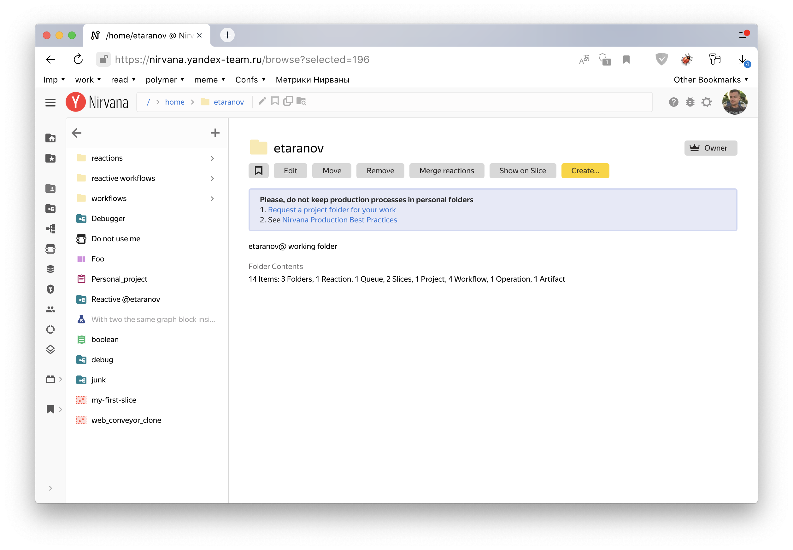
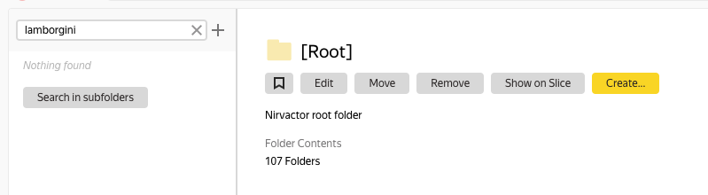
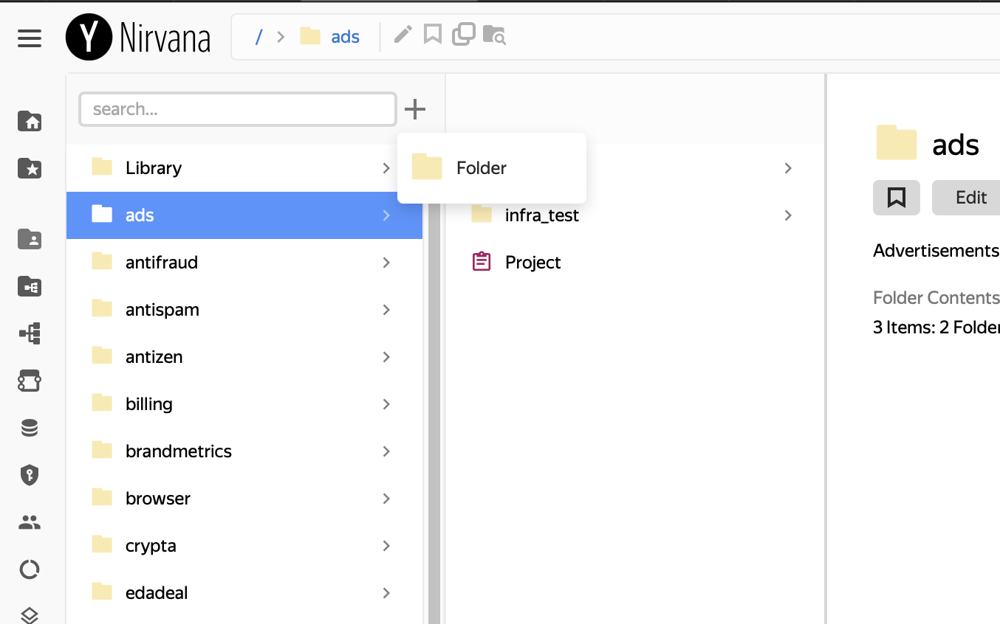

# Урок 2. Дерево навигации



## Шаг 1. Изучим дерево навигации {#step-1}

Чтобы систематизировать процессы пользователей в Нирване, разработчики создали **Дерево навигации**. Оно содержит **Каталоги** — папки, в которых размещаются разные объекты, созданные пользователями. Например, воркфлоу, операции, данные и т. д.

Сверху навигации есть хлебные крошки. Они показывают путь от корня дерева навигации до текущей папки.

## Шаг 2. Рассмотрим каталоги {#step-2}

### Персональный каталог

Перейдем в свой [персональный каталог](https://nirvana.yandex-team.ru/browse?) (домашний). Из интерфейса Нирваны можно легко перейти в него с помощью кнопки  в меню слева. Иногда персональный каталог называют «хомяк» от слова «home» – дом.

Pro tips: Количество отображаемых уровней навигации можно менять потянув за границу панели навигации

Персональный каталог есть у каждого (в том числе у роботов). Сюда стоит складывать только те операции, процессы и данные, которые могут потребоваться только вам.

Персональный каталог удобен для старта. Как только процесс становится чем-то большим, чем эксперимент, например, обслуживает какой-то сервис, запускается регулярно и требует участия других членов команды, его нужно перенести в подходящий **Проектный каталог**.

### Проектный каталог

В проектном каталоге собраны процессы, обслуживающие сервис или крупную задачу уровня компании. Организация иерархии происходит в соответствии с потребностями проекта. Хорошей идеей будет предусмотреть несколько уровней внутри проекта. Примеры названий хороших проектных каталогов: [/nirvana](https://nirvana.yandex-team.ru/browse?selected=6864179), [/alice](https://nirvana.yandex-team.ru/browse?selected=325171), [/billing](https://nirvana.yandex-team.ru/browse?selected=6474596), [/toloka](https://nirvana.yandex-team.ru/browse?selected=7455773), [/search](https://nirvana.yandex-team.ru/browse?selected=302162).

Не стоит спешить создавать новый проектный каталог, лучше потратить немного времени на поиски подходящего. В каждой секции навигации можно поискать по этому уровню навигации.

Pro tips: Кнопка `Search in subfolders` позволяет искать по всему поддереву, при этом интерфейс переключится в специальный режим с возможностью уточнить конкретный тип нужных объектов.

При помощи хлебных крошек переходим [в корень /](https://nirvana.yandex-team.ru/browse?selected=1).

Поищем что-нибудь подходящее. Если ты уже знаешь, в рамках какого ABC-сервиса ты будешь работать, или коллеги рассказывали «где у нас все лежит», можно поискать эту папку.

Предположим, что нам не удалось найти подходящий каталог в корне. Вот досада :(

Чтобы создать новый каталог, нужно отправить заявку:
1. Нажимаем кнопку плюса в верхней части одной из панелей навигации или **Create...**

   

2. Заполняем форму заявки.
3. В этот раз нажимаем `Cancel`, чтобы не спамить дежурных :)
Если в следующий раз понадобится "боевой" каталог, то после создания заявки, её рассмотрит дежурный в ближайшее время и создаст каталог для твоей команды или предложит разместить проект в одном из существующих каталогов.
