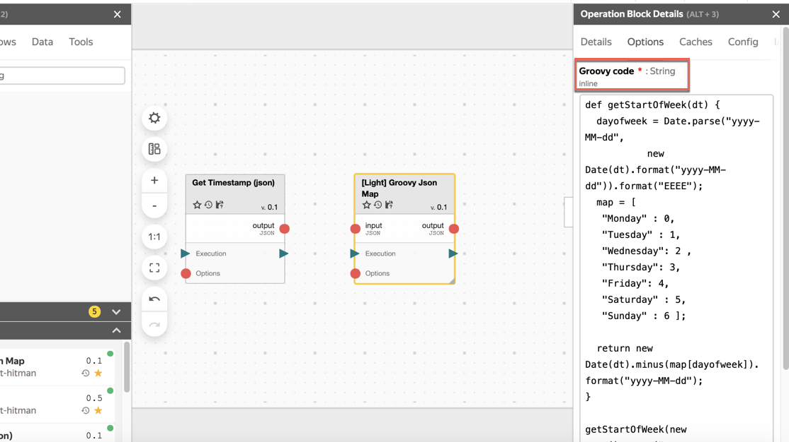

# Урок 4. Введение в операции



## Шаг 1. Рассмотрим произвольную операцию {#step-1}

Вычисления в нирване выполняются с помощью операций, которые визуализированы в редакторе графа в виде блоков (или кубиков).Пример операции в редакторе графа:


Операции можно найти в [библиотеке операций](https://nirvana.yandex-team.ru/browse?selected=879274) или создать самому, если не нашлось нужной операции.

Чтобы запустить операцию, нужно добавить ее на граф, тогда она появится в виде блока.

У блока операции есть несколько состояний:— Черновик (Draft).
- Выполняющаяся (Running).— Успешно выполненная (Success).— Завершенная с ошибкой (Failure).— Отмененная пользователем (Canceled).
- Пропущенная (Skipped).


## Шаг 2. Создадим новый воркфлоу {#step-2}

Разработка будущего процесса или работа с текущим в Нирване происходит в рамках **Воркфлоу** (Workflow). В воркфлоу ведется разработка процесса и хранятся запуски (графы). А еще в воркфлоу можно делать задачи Ad hoc.

Чтобы создать воркфлоу в корне персональной папки:
1. Нажмем кнопку **Сreate...** -> **Workflow**.

   

2. В открывшемся окне в правом верхнем углу нажмем **Save**.
3. Укажем имя воркфлоу, например "Hello Workflow" и нажмем **Apply**.


Отлично! Первый воркфлоу создан.

Откроется редактор графа.

## Шаг 3. Добавим операцию на граф {#step-3}

1. Откроем палитру поиска объектов. На верхней панели слева нажмем значок плюса и выберем вкладку **Operation**.
2. Найдем операцию `Get timestamp (json)` и перетащим ее в редактор графа.

   

3. Сохраним граф:3.1 Нажмем кнопку **Save** на верней панели и добавим название воркфлоу.3.2 Нажмем **Apply**.
4. Запустим граф. Нажмем кнопку **Run...** на верхней панели.
5. В открывшемся окне подтвердим запуск c квотой по умолчанию **Run with selected quota**.
Если операция выполнилась, то мы увидим позеленевший кубик, вот такой:

   

# Шаг 4. Добавим еще одну операцию на граф {#step-4}

Попробуем усложнить задачу и сделаем граф из двух операций.
1. Создадим копию текущего графа:1.1 На верхней панели нажмем кнопку **Clone**.1.2 Будет создан новый экземпляр этого графа в статусе Draft.
2. Найдем операцию `[Light] Groovy Json Map` в библиотеке и перетащим ее в редактор графа.   2.1 Добавим код в опцию операции `[Light] Groovy json map`. Для этого нажмем блок операции на графе  и перейдем в **Option block details** -> **Options** -> **Groovy code**:

   




```java
def getStartOfWeek(dt) {
     dayofweek = Date.parse("yyyy-MM-dd",
              new Date(dt).format("yyyy-MM-dd")).format("EEEE");
     map = [
      "Monday" : 0,
      "Tuesday" : 1,
      "Wednesday": 2 ,
      "Thursday": 3,
      "Friday": 4,
      "Saturday" : 5,
      "Sunday" : 6 ];

     return new Date(dt).minus(map[dayofweek]).format("yyyy-MM-dd");
   }

getStartOfWeek(new Date().parse("yyyy-MM-dd'T'HH:mm:ss", _).getTime())
```



Какой результат мы хотим получить данным кодом? Мы хотим взять сегодняшнюю дату и вернуть дату понедельника на этой неделе.

   

3. Соединим эти два блока операции и запустим их.

4. Посмотрим результат выполнения в выходе блока `[Light] Groovy json map`

   

Круто, мы только что произвели с тобой самостоятельно наши первые вычисления и узнали дату понедельника на этой неделе!

В нашем случае блоки операций запускались один за другим, последующий блок ждал результатов выполнений от предыдущего, потому что они соединены с помощью связей.Пройдя этот курс, ты сможешь создавать сложные пайплайны, которые как конвейер будут преобразовывать данные.
