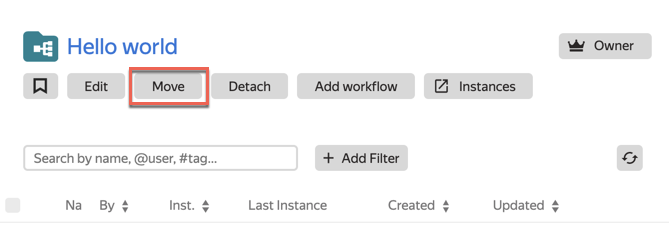
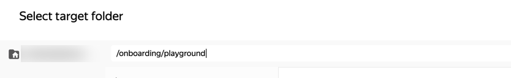

# Урок 9. Организация рабочих процессов



В Нирване принято группировать похожие процессы. Например, связанные с одной задачей или сервисом лучше размещать рядом, чтобы всё хранилось под рукой и не было проблем с доступами.

В предыдущих уроках мы уже познакомились с воркфлоу. Давай нажмем на хлебную крошку с названием воркфлоу и рассмотрим его паспорт (карточку сущности). В нём представлена основная информация о воркфлоу (название, описание, владелец) и возможные операции (редактирование, перемещение, удаление и т. д.). У каждого объекта в дереве навигации есть такая карточка. Вот так выглядит одна из них.

   

## Создадим группу воркфлоу {#step-1}

Если у вас есть несколько процессов, которые объединяются одной идеей/задачей, их можно положить рядышком по одному в рамках директории (прямо как в операционной системе) или сделать круче! Можно сложить их в одну **Группу Воркфлоу** и получить удобное табличное отображение с возможностью фильтрации. Например, вот так выглядят группа воркфлоу, обслуживающая релиз документации по Нирване. Это удобно!

   

Давай превратим один воркфлоу в группу:

1. Нажимаем **Add Workflow** и сохраняем еще один в ту же группу.

   

2. Добавим описание группы воркфлоу в поле **Description**, а заодно и переименуем. 2.1 Нажимаем **Edit**.2.2 Проверяем заполненные поля и нажимаем **Save**.
> - Всем объектам в дереве навигации можно задавать описание. Заполнять это поле в Нирване — правильная практика, она позволяет коллегам лучше ориентироваться и разбираться в чужих процессах. Не стоит лениться в этом месте.
> - Все имена и описания лучше задавать на английском. Яндекс развивается, и у нас появляется всё больше англоговорящих коллег, которые используют Нирвану.

   

## Переместим группу воркфлоу в проектный каталог {#step-2}

Переместим нашу группу воркфлоу в каталог курса `/onboarding/playground`:
1. На карточке нашей группы воркфлоу нажмем **Move**.

   

2. В окне **Select target folder** в хлебных крошках изменим путь до папки, указав `/onboarding/playground` и нажав **Enter**.

   

3. Откроется папка `playground`. В правом нижнем углу нажми кнопку **Move**.

Вот и всё, теперь группа воркфлоу в проектной папке обучения!

После перемещения у группы воркфлоу появились новые права, назначенные на вышестоящие каталоги. Теперь наша группа воркфлоу доступна для редактирования для всех участников роли [nirvana.onboarding](https://nirvana.yandex-team.ru/roles/nirvana.onboarding):

