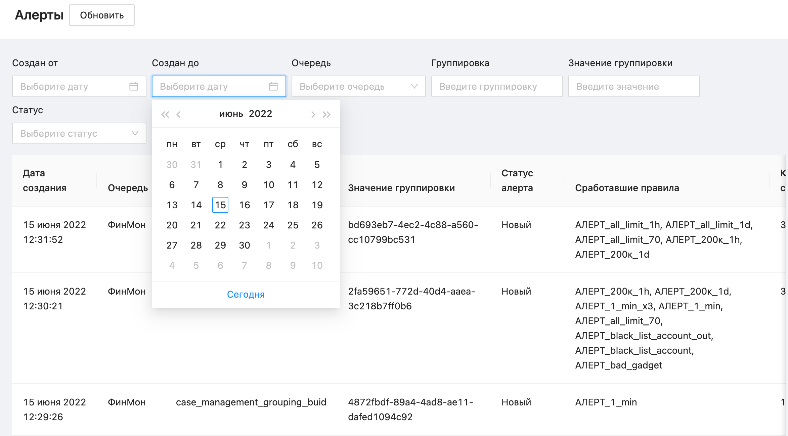
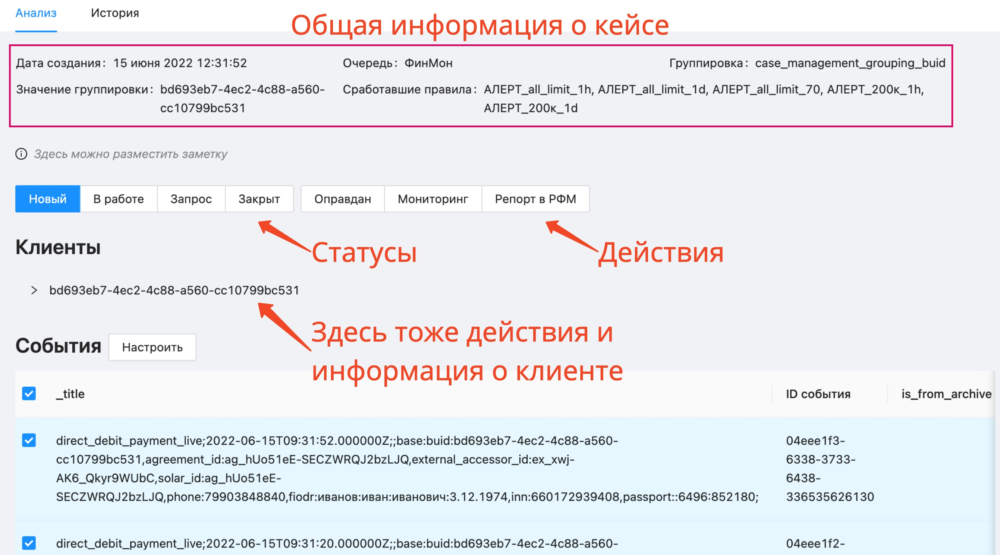

# Начало работы с админкой Case Management



## Перед началом

Убедитесь, что у вас есть доступ к нужной админке:
* [Тестинг (NPE)](https://antifraud-system-admin.npe.yabank-team.net/case_management/alerts).
* [Продакшн](https://antifraud-system-admin.prod.yabank-team.net). По умолчанию доступ закрыт и выдаётся только сотрудникам с **банковским** ноутбуком.

Если доступа нет, сначала [настройте VPN](../access/vpn.md).

## Посмотрите входящие кейсы

Откройте [страницу **Алерты**](https://antifraud-system-admin.npe.yabank-team.net/case_management/alerts) в админке Case Management.

Здесь у каждого алерта видно, сколько было событий внутри и какие правила сработали.



Если алертов слишком много, отфильтруйте лишние, например по дате.





Если в списке кейсов подозрительно пусто, возможно вам не выдано никакой роли для просмотра событий. rusakovdv@ вам поможет.



## Проанализируйте алерт

Нажмите на какой-нибудь алерт в списке, чтобы посмотреть подробную информацию. Выглядит это так:



Шаги ниже — чтобы вы разобрались в интерфейсе. Точный порядок действий узнавайте у своей команды — у всех свои бизнес-процессы и свой набор кнопок.



### Шаг 1. Проставьте статус

Например, покажите что вы начали работать над алертом — переведите его в подходящий статус, например **В работе**. 

В некоторые статусы можно возвращаться, в некоторые — нет. Список статусов и переходы между ними можно настроить.

### Шаг 2. Разберитесь в ситуации

Изучите информацию об алерте, о клиентах и событиях.

Если информации не хватает:
* Настройте поля таблицы **События**, чтобы увидеть больше данных.
* Поищите другие события:
  * В разделе **Выборки** — это быстрые фильтры по событиям, например можно найти все события по номеру телефона клиента.
  * На отдельной странице **События** — здесь все доступные вам события.

### Шаг 3. Выполните необходимые действия

В интерфейсе есть два набора кнопок с действиями:
1. Действия с алертом или событиями.
2. Действия с конкретным пользователем.

Еще можно добавить заметку — её увидят все, кто работает с этим алертом. Они также смогут отредактировать эту заметку.

Когда всё готово, переведите кейс в финальный статус и переходите к следующему.

## Что дальше

* На вкладке **История** посмотрите, что происходило с алертом.
* На странице **События** показаны все события. Попробуйте найти то, которое вы рассматривали или поискать что-то ещё.
* Разработчику:
  * [Посмотрите, как создавать различные события](https://wiki.yandex-team.ru/fintech-team/fintech-antifraud/antifraud-events).
  * [Почитайте другую информацию на Вики](https://wiki.yandex-team.ru/fintech-team/fintech-antifraud).

