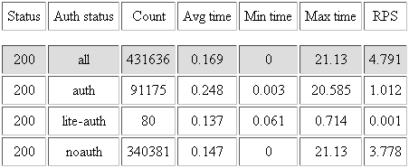

# control-response-time.xml

Выдает статистику по статусам ответов на запросы.

В файле отображается следующая информация:

- **Status** - код статуса ответа;
- **Auth status** - статус авторизации пользователя, отправившего запрос. **all** - все пользователи; **auth** - авторизованные пользователи; **noauth** - неавторизованные пользователи;
- **Count** - количество ответов с указанным кодом на запросы от пользователей с данным статусом;
- **Avg time** - среднее время ответа (в секундах);
- **Min time** - кратчайшее время ответа;
- **Max time** - самое продолжительное время ответа;
- **RPS** - количество ответов в секунду.

Входит в пакет [xscript-yandex-www](../concepts/packages.md#xscript-yandex-www) или [xscript-yandex-www5](../concepts/packages.md#xscript-yandex-www5).

Устанавливается в директорию вёрстки (`/usr/local/www/xscript/` или `/usr/local/www5/xscript/`) и может быть просмотрен в окне браузера.

