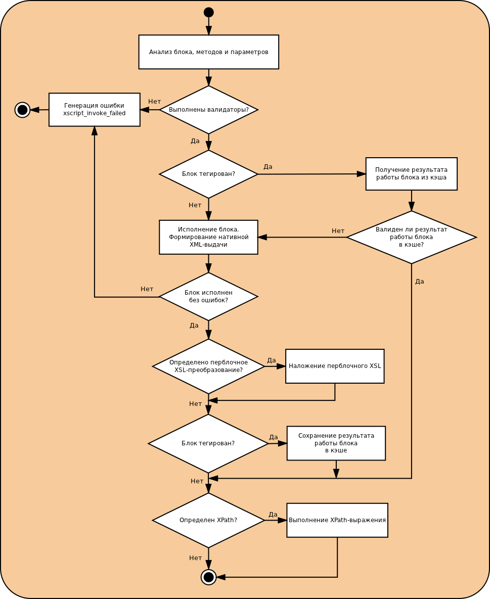

# Обработка XScript-блока

Процесс обработки блока любого типа показан на следующей диаграмме:

* [Понятие XScript-блока и его типы](../concepts/block-ov.md)
* [Атрибуты XScript-блоков](../appendices/attrs-ov.md)
* [Перблочное XSL-преобразование](../concepts/per-block-transformation-ov.md)
* [Кэширование результата работы XScript-блока](../concepts/block-results-caching.md)
