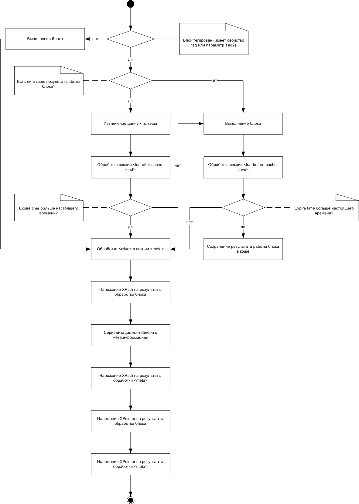

# Обработка блока с секцией \<meta\>

Процесс обработки блока с секцией \<meta\> показан на следующей диаграмме:

* [Понятие XScript-блока и его типы](../concepts/block-ov.md)
* [Обработка XScript-блока](../concepts/block-handling-ov.md)
* [Кэширование результата работы XScript-блока](../concepts/block-results-caching.md)
* [Метаинформация о вызове блока](../concepts/meta.md)