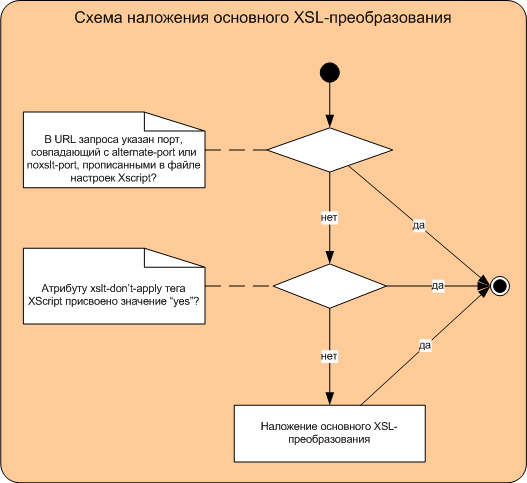

# Основное XSL-преобразование

После [обработки XScript-блоков](block-handling-ov.md), включающей стадию наложения перблочного XSL-преобразования, на страницу накладывается основное XSL-преобразование.

Цель основного XSL-преобразования - приведение документа к формату, в котором он будет выдан конечному пользователю. Корректными форматами являются XML, HTML, plain text и WML.

Основное XSL-преобразование определяется в [исходном XML-файле](../appendices/example-page.md), как показано ниже:

```
<?xml-stylesheet href="xsl/task.xsl" type="text/xsl"?>
```

Параметры HTTP-запроса, а также заголовки Host, Referer, User-Agen  и т. д. можно передать внутрь преобразования в виде XSL-параметров, которые определяются с помощью свойства [xslt-param](../reference/xslt-param.md) тега [\<xscript\>](../reference/xscript.md). Например:

```
<xscript>
   <xslt-param id="text" type="QueryArg"/>
   <xslt-param id="p_n" type="QueryArg"/>
   <xslt-param id="Host" type="HttpHeader"/>
   <xslt-param id="forum_id" type="QueryArg"/> 
</xscript>
```

Основное XSL-преобразование может быть переопределено в методе Mist-блока [attach_stylesheet](../appendices/block-mist-methods.md#attach_stylesheet).

Ниже приведена схема наложения основного XSL-преобразования:




## Временная отмена основного XSL-преобразования {#genxslt-noxslt}

Иногда в целях отладки необходимо отменить наложение XSL-преобразования. Это можно сделать двумя способами: на уровне XML-файла и на уровне запроса к веб-странице.

### Отмена на уровне XML-файла {#genxslt-noxslt}

Основное XSL-преобразование не будет накладываться на данный XML-файл, если в нём установлен атрибут `xslt-dont-apply="yes"` тега [\<xscript\>](../reference/xscript.md).

```
<xscript xslt-dont-apply="yes">
   ...
</xscript>
```

### Отмена на уровне запроса {#genxslt-noxslt}

Чтобы получить страницу на XScript без общего XSL-преобразования, в URL запрашиваемой страницы необходимо указать номер порта `alternate-port` (страница без основного XSL-преобразования) или `noxslt-port` (страница и без основного, и без перблочного XSL-преобразования), которые задаются в [файле настроек](../appendices/config.md) XScript.

Например:

```
http://something.cloudkill.yandex.ru:8080/
```

### Узнайте больше {#learn-more}
* [XScript-блок в файле XSL-преобразования](../concepts/xscript-block-in-xsl.md)
* [Перблочное XSL-преобразование](../concepts/per-block-transformation-ov.md)
* [Общий процесс обработки запроса](../concepts/request-handling-ov.md)
* [Заключительный этап](../concepts/request-handling-final.md)