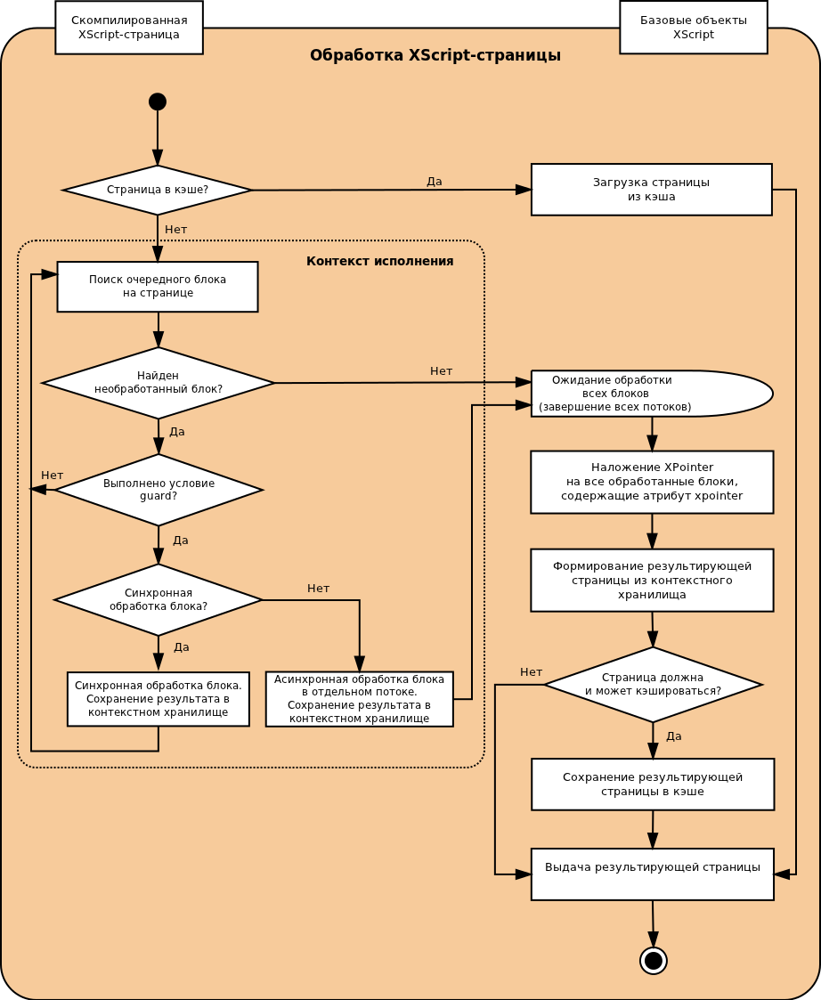

# Второй этап: обработка XScript-страницы

Основной этап обработки запроса показан на следующей диаграмме:

На этом этапе происходит обработка XScript-страницы, соответствующей запрашиваемому пользователем URL. Происходящая при этом обработка содержащихся на странице блоков более подробно рассмотрена в [следующем разделе](block-handling-ov.md).

Блоки могут обрабатываться синхронно и асинхронно. Синхронная обработка блоков производится в основном потоке. При этом обработка каждого следующего блока начинается в тот момент, когда закончилась обработка предыдущего. При асинхронной обработке каждому блоку выделяется отдельный поток. Если в пуле параллельных потоков нет свободного потока, блок обрабатывается в основном потоке.

Результаты обработки блоков размещаются в контекстном хранилище. После завершения обработки XScript-страницы формируется страница, выдаваемая пользователю. При этом результаты обработки блоков извлекаются из контекстного хранилища.

### Узнайте больше {#learn-more}
* [Понятие XScript-блока и его типы](../concepts/block-ov.md)
* [Атрибут xpointer](../appendices/xpointer.md)