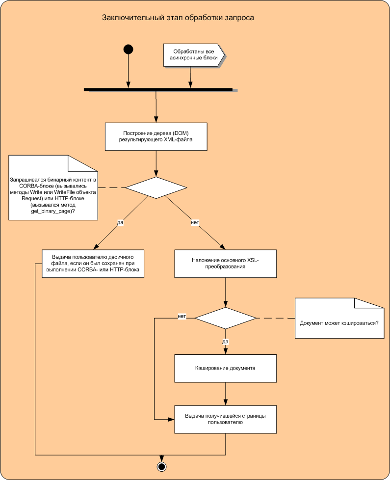

# Заключительный этап

Заключительный этап обработки запроса показан на следующей диаграмме:

На последнем этапе суммируется работа, выполненная ранее, происходит ожидание работы асинхронных блоков.

После этого результат выдается пользователю в виде двоичного файла или страницы.

Если возвращается страница, то её окончательный вид и формат формируются на шаге наложения [основного XSL-преобразования](general-transformation-ov.md).

### Узнайте больше {#learn-more}
* [Как вернуть пользователю двоичный файл](../tasks/how-to-return-binary-file.md)