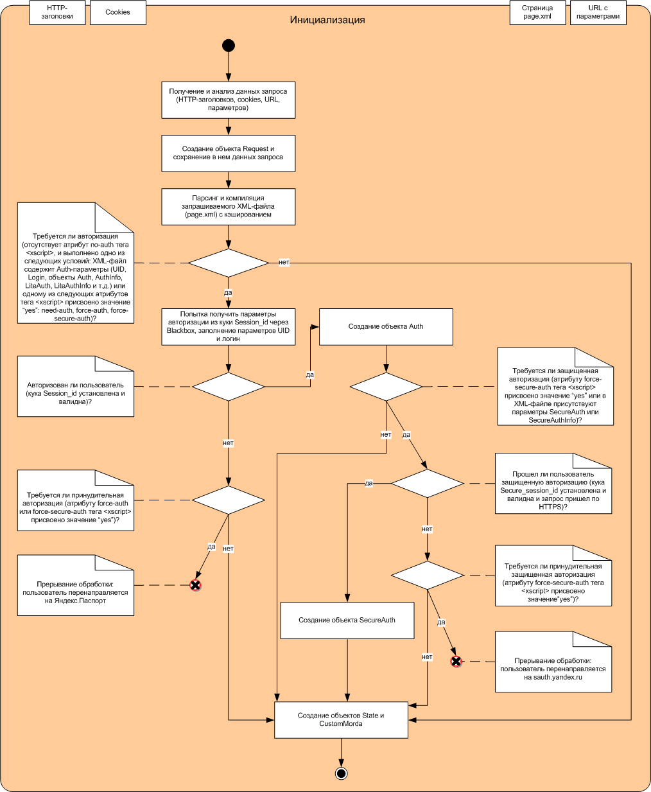

# Первый этап: инициализация

На этапе инициализации анализируется вся информация о данном HTTP-запросе: URL и параметры запроса, HTTP-заголовки, куки и т. д. Создаются базовые объекты XScript: [Request](request-ov.md), [State](state-ov.md), [CustomMorda](custom-morda-ov.md), [Auth и SecureAuth](auth-ov.md).

Процесс инициализации показан на следующей диаграмме:



Можно устанавливать время кэширования XML-файла позволяет атрибут  тега [\<xscript\>](../reference/xscript.md).



### Узнайте больше {#learn-more}
* [Кэширование XML-страницы](../concepts/caching-ov.md)