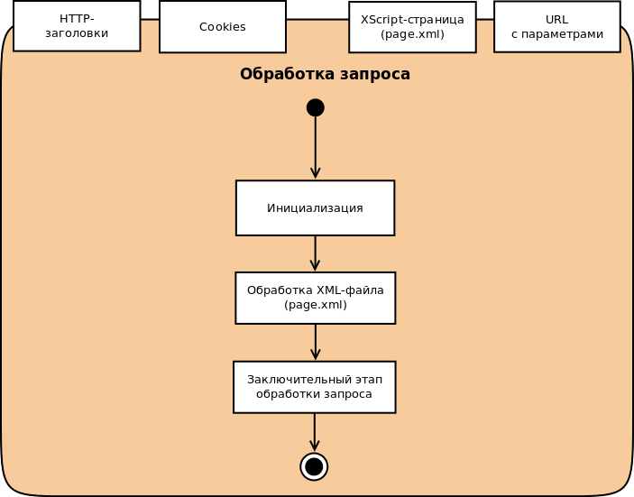

# Общий процесс обработки запроса

Общий процесс обработки запроса страницы, написанной с использованием XScript, показан на следующей диаграмме:

Как видно из схемы, вся обработка запроса состоит из трёх основных этапов:

1. [Инициализация](request-handling-init.md).
1. [Обработка XML-файла](request-handling-file.md).
1. [Заключительный этап обработки](request-handling-final.md).

### Узнайте больше {#learn-more}
* [XML-файл на XScript](../concepts/xscript-file-ov.md)
* [Как создать веб-страницу с использованием XScript](../tasks/how-to-design-page-with-xscript.md)